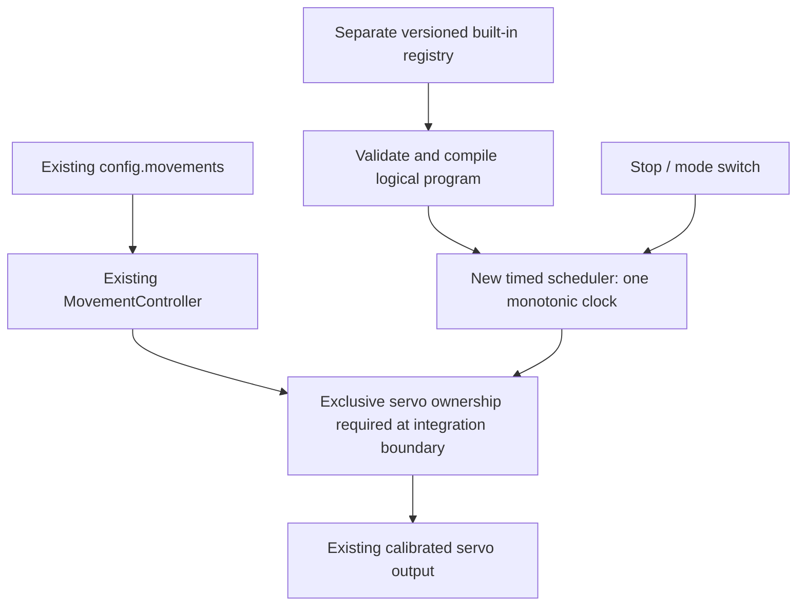

# Pi0 built-in movement refinement: a separate timed controller

Date: 2026-10-09. **Design proposal for future development; not implemented.**

A separate built-in movement controller is feasible. It can preserve OTTO's shared oscillator clock and explicit pauses more faithfully than the current waypoint executor. It needs its own validated program format, scheduler, cancellation token, and exclusive access to the servo outputs. Adding duration or oscillator fields to today's movement JSON would not achieve this: the existing controller does not read them.

The approved implementation is described in [SpiderBuildinMovements.md](SpiderBuildinMovements.md). Its 19 opt-in entries cover 16 OTTO methods and selected directional variants using existing `moves`, `speed`, and optional `per_servo_speeds` conventions. **No existing NinjaRobotPi0 movement-control function has been changed.** This document does not authorize or implement a replacement, new endpoint, hardware test, or automatic configuration migration.

## 1. Evidence and present behavior

The local `ninjarobot_pi0_Wiki` was retrieved using `python3 scripts/wiki.py search "moves per_servo_speeds speed"` and movement/servo searches. Relevant pages are [Motion System and Easing](../ninjarobot_pi0_Wiki/wiki/concepts/motion-system-and-easing.md), [pi0servo](../ninjarobot_pi0_Wiki/wiki/entities/pi0servo.md), and [API and CLI Reference](../ninjarobot_pi0_Wiki/wiki/references/api-and-cli-reference.md). They are draft and unverified, with recorded AI semantic reviews; this is not physical or human verification. Source IDs include `src-20260822-readme-7` and `src-20260822-developmentguide`. Current manuals are resolved through [project-knowledge.json](../ninjarobot_pi0_Wiki/project-knowledge.json).

Code inspection takes precedence where broad wiki wording such as “simultaneous” or “preserves momentum” suggests stronger timing guarantees. The current implementation shares a loop start time, but does not enforce common arrival or continuity of velocity across waypoints.

| Contract | Verified implementation | Consequence for translation |
|---|---|---|
| `moves` | GPIO-to-angle object; string keys become integers; targets ordered by the actual driver pin list | Preserve GPIO identity, never assume list index equals OTTO ID |
| `speed` | Required step key; native modes F/M/S | A velocity choice, not a period or duration |
| `per_servo_speeds` | Optional GPIO-to-mode overrides; fallback is step speed | Changes each joint's travel time independently |
| Missing target | Driver receives `None` for that pin | No new command, not an implicit neutral pose |
| Unknown pin | Silently absent from ordered driver targets | Future validator should reject it |
| Easing | Single step in/out cubic; first in cubic, middle linear, last out cubic | Endpoint shape is executor-selected, not a stored curve |
| Completion | Waits for maximum of the individual servo durations | Shorter-distance joints can arrive sooner |
| Delay / period / repeat | No such fields are consumed | Extra JSON keys cannot add scheduling |
| Validation | `NinjaConfig.movements` is `Dict[str, list]` | Outer shape validation does not validate each step |
| Position knowledge | Last command, then pulse-derived estimate, then calibration center | No encoder feedback or proof of arrival |
| Cancellation | `abort_check` is not polled or forwarded; unsuccessful driver move plus a truthy callback triggers centering and `EmergencyStop` | Existing callback is not a reliable continuous cancellation contract |

Primary locations: [MovementController](../ninja_core/src/ninja_core/movement_controller.py), [configuration](../ninja_core/src/ninja_core/config.py), [ServoGroup](../pi0servo/src/pi0servo/core/multi_servos.py), [duration calculator](../pi0servo/src/pi0servo/motion/calculator.py), [Servo](../pi0servo/src/pi0servo/core/servo.py), and [HAL servo setup](../ninja_core/src/ninja_core/hal.py). Source OTTO parameters and bugs were cross-checked against the unchanged umbrella-workspace `RoboticsRepoReference/OTTOquad-master/firmwareVER_9/OTTOKame.cpp`, `Octosnake.cpp`, and `OttoQuadMovementIntro.md`.

### A current, executable-format example

This is an entry inside the existing `movements` object:

```json
{
  "example": [
    {"moves": {"20": 20, "21": -20}, "speed": "M", "per_servo_speeds": {"21": "S"}},
    {"moves": {"20": 0}, "speed": "M"}
  ]
}
```

GPIO20 uses M and GPIO21 uses S in the first step. The second step only commands GPIO20. It does not wait for an added pause or center GPIO21. Repeating an unchanged target has zero calculated travel time, so it cannot stand in for a dwell.

The driver's nominal velocity is `600 × calibration_speed_percent / 100 × mode_multiplier` degrees/second, where F=1, M=0.75, S=0.5. Duration is absolute angular distance divided by this velocity. For two joints starting at zero, a linear 20° move at 80% calibration speed takes about 55.6 ms in M or 83.3 ms in S. Cubic easing changes instantaneous velocity; these calculated durations do not guarantee physical speed or arrival. The 600°/s constant is an assumed motor specification, not a measurement of this Spider. A nonpositive calculated velocity produces zero duration in the present code; **speed zero must not be interpreted as a stop command**.

## 2. What can be preserved

| OTTO feature | Existing waypoint pack | Proposed separate controller |
|---|---|---|
| Logical pose and corrected GPIO mapping | Yes, nominal q−90; mounting still unverified | Yes, through an explicit validated robot profile |
| Sine amplitude/offset/phase | Sampled positions only | Analytic evaluation on one clock |
| Period T and per-joint T/2 | Stored as generator provenance only | Explicit period per joint |
| Pause following a pose command | Unsupported | Cancellable dwell action |
| Continuous oscillator refresh | Finite one-cycle samples | Finite cycles first; explicit continuous mode later |
| Common arrival for a timed pose | No | Shared interpolation duration |
| OTTO `steps` | Source `execute()` ignores it | Deliberate finite-cycle semantics, clearly a correction |
| Source calibration/reversal | Not copied without Pi0 evidence | Separate measured profile; no inferred inversion |
| Source history-dependent helper bugs | Partial representative hello sequence | Must choose literal emulation or corrected intent |
| Physical foot contact, load and balance | Unverified | Still requires physical validation |

The useful fidelity target is the **logical commanded trajectory**, not identical mechanical motion. Source oscillator periods do not establish that a loaded Pi0 servo can follow them. Pi0 OS scheduling and sequential GPIO writes also prevent a promise of perfectly simultaneous physical motion.

## 3. Proposed architecture and compatibility boundary

Add a separate module, provisionally `builtin_movement_controller.py`, with a `BuiltinMovementController` and a distinct program registry, provisionally `builtin_movements`. Names and paths here are proposals, not existing imports or API fields. Keep `MovementController`, its configuration, native speed meanings, recording format, and existing API responses unchanged.



The ownership box is a **future integration requirement**, not an existing universal lock. [runtime_pipeline.py](../ninja_core/src/ninja_core/runtime_pipeline.py) coordinates native/Blockly mode and requests aborts, but is not a lock around every servo writer or proof that an earlier writer has joined. A standalone new class is insufficient if a web request, Blockly action, native animation, centering request, or shutdown action can write concurrently.

A future integration phase should provide one owner at a time, reject or explicitly replace overlapping requests, cancel and join the old owner before handing over, and prevent a stale worker from writing after ownership changes. Prefer an additive orchestration adapter around call sites; any necessary existing call-site edits require a separately reviewed implementation plan. If complete ownership cannot be enforced without changing existing entry points, ship only an isolated opt-in runner until that integration is approved. Do not publish a concurrent endpoint prematurely.

The new scheduler can evaluate trajectories in one worker and use the existing calibrated `Servo.set_angle` output through an adapter. It must not call `move_all_sync` once per sample: that method adds distance-based timing/easing and resets its own abort flags at each entry. Reusing that loop would distort phase and risk losing cancellation between samples. Reusing calibrated output does not automatically reuse motion speed limits; the new compiler must enforce those separately.

### Clock and execution contract

- Use a monotonic clock and absolute deadlines, evaluating every commanded joint from the same elapsed time. A provisional 10 ms tick matches the present loop interval, but is not a measured Pi timing guarantee.
- If late, evaluate the current phase rather than replaying a queue of stale samples. Record skipped deadlines and peak lateness. Set an explicit lateness threshold that aborts rather than silently stretching an individual joint.
- Validate the entire finite program before acquiring outputs. Keep continuous programs bounded in memory; do not expand infinite lists.
- Check a scheduler-owned cancellation token before writes, between joint writes, during waits and dwells, and between actions. A cancellation can occur partway through a multi-joint frame; report the last issued command and do not claim atomic output.
- On cancellation, stop generating targets and retain the last commanded pulse by default. Whether to hold, release, or move to a recovery pose must be an explicit robot policy; automatic centering can itself cause motion or instability. Command cancellation is not power isolation.
- A hardware fault stops further actions, records failure, and releases software ownership after the worker exits. No automatic retry of a failed physical command. Cleanup must not send an unrequested home pose.
- Command completion means the scheduled final target was issued, not that measured physical arrival occurred. Record both planned duration and actual wall time.

## 4. Proposed program format — not accepted by today's executor

Use a separate, strictly validated `schema_version: 1` document. Do not mix these fields into `config.movements` or silently reinterpret existing speed values. A proposed program has a robot-profile reference, entry policy, actions and explicit completion policy. Reject unknown fields and nonfinite values, booleans masquerading as numbers, duplicate/unknown GPIOs, invalid units, nonpositive periods, negative durations and unbounded repetition unless explicitly supported.

| Proposed action/field | Meaning |
|---|---|
| `pose` / `moves` / `duration_ms` / `curve` | Interpolate from last known commanded state to target over one shared positive duration; curve linear or explicitly named easing |
| `dwell` / `duration_ms` | Issue no new target, retain pulse output and wait cancellably |
| `oscillate` / `joints` / `run_for_ms` | Per GPIO: signed `amplitude_deg`, `offset_deg`, `phase_deg`, positive `period_ms`; evaluate all from one phase epoch |
| `entry` | Before starting an oscillator clock, approach its t=0 pose with validated velocity; entry time is outside `run_for_ms` |
| `limit_policy` | Reject infeasible program by default; optional whole-program timing stretch must be explicit and reported |
| `on_complete` | Hold final target by default; home/release only as an explicit policy |

For clarity, the examples below show **action fragments**. They are illustrative specifications for a future schema, not runnable configuration for either controller today. A complete future program must include its version, measured profile, entry policy and completion policy.

A normal timed pose uses a positive duration. A separate privileged `pose_write` action may be considered for literal OTTO instantaneous-command sequences; it bypasses trajectory velocity shaping and should be disabled in the initial implementation. Do not overload zero duration to secretly mean instant output. A “pause after command” and a “pause after a timed transition completes” are different semantics.

### Speed and timing policy

Keep old F/M/S behavior unchanged in the old controller. In the new schema, use explicit degrees/second limits from an approved profile. An optional compatibility adapter could resolve F/M/S to the current calculation, including per-servo overrides, but must label them nominal software limits and must not mutate the old configuration.

For `angle(t) = offset + amplitude × sin(2πt/period + phase)`, the maximum commanded angular velocity is `2π × abs(amplitude) / period_seconds`. A per-joint limit must constrain this peak, not the average step distance. For a pose interpolation `start + delta × e(u)`, the peak is `abs(delta) × max(abs(e′(u))) / duration_seconds`: linear multiplier 1, the current cubic curves peak at 3. Check acceleration/jerk and mechanical loading separately; satisfying velocity alone is insufficient.

If any joint fails, reject by default or stretch **all coupled periods and related action times by one reported factor**. Slowing one leg independently changes phase relationships. Do not silently clip amplitudes or independently clamp samples; that changes the gait. Explicit legacy clipping (such as hello) belongs in a separately named, reviewed adaptation.

| Source example | Nominal peak | Comparison to hypothetical M at 80% = 360°/s |
|---|---:|---|
| run: A=15°, T=550 ms | 171.36°/s | Below nominal ceiling; not physical approval |
| waveHAND: abs(A)=20°, T=700 ms | 179.52°/s | Below nominal ceiling |
| walk foot: A=20°, T=275 ms | 456.96°/s | Above ceiling; reject or stretch |
| hello moving joint: A=50°, T=350 ms | 897.60°/s before clipping | Above ceiling; also exceeds one angle bound |

Walk needs at least 349.07 ms foot period and 698.14 ms hip period at that hypothetical ceiling (common factor about 1.2694). Real measured limits may demand slower motion. Limits must be checked after direction/offset transformation and for transitions into and out of the wave, not only within its cycle.

## 5. GPIO, calibration and transformation

Use the approved mapping from [SpiderBuildinMovements.md](SpiderBuildinMovements.md#3-spider-hardware-and-servo-mapping): S0→25, S1→24, S2→27, S3→26, S4→21, S5→20, S6→23, S7→22. All are BCM GPIOs. With nominal orientation, target amplitude stays the same, offset becomes `source_offset−90`, phase and period are unchanged.

A future measured orientation profile may apply `target = direction × (source_angle−90) + logical_offset`, with direction +1 or −1. For a sine this becomes `A′=direction×A`, `O′=direction×(O−90)+logical_offset`; leave phase unchanged. Do not also add 180° phase when using signed amplitude or the reversal is applied twice. Logical trim must not duplicate pulse calibration or OTTO EEPROM trim.

The source reverses S2 on its own assembly. No inspected Pi0 hardware evidence establishes that GPIO27 needs the same reversal, so both current pack and nominal examples omit it. Current HAL selects pins from core config, while actual driver calibration is separately loaded from `servo.json`. Missing driver calibration can have flat 1500/1500/1500 endpoints; validate an approved profile rather than assuming core defaults reach the motors. Validate the full angle envelope against configured bounds and measured clearance. Existing `set_angle` clamps pulse conversion but caches the requested angle, so prevalidation is necessary to avoid treating an out-of-range request as the achieved state.

## 6. Worked OTTO translations

### Run forward: preserve a 550 ms clock

Source `run(0)` uses eight amplitudes of 15°, offsets `[105,75,90,90,75,105,90,90]`, and phases `[0,0,90,90,180,180,90,90]` in S0…S7 order. The new action could be:

```json
{
  "kind": "oscillate",
  "run_for_ms": 550,
  "joints": {
    "20": {"amplitude_deg": 15, "offset_deg": 15, "phase_deg": 180, "period_ms": 550},
    "21": {"amplitude_deg": 15, "offset_deg": -15, "phase_deg": 180, "period_ms": 550},
    "22": {"amplitude_deg": 15, "offset_deg": 0, "phase_deg": 90, "period_ms": 550},
    "23": {"amplitude_deg": 15, "offset_deg": 0, "phase_deg": 90, "period_ms": 550},
    "24": {"amplitude_deg": 15, "offset_deg": -15, "phase_deg": 0, "period_ms": 550},
    "25": {"amplitude_deg": 15, "offset_deg": 15, "phase_deg": 0, "period_ms": 550},
    "26": {"amplitude_deg": 15, "offset_deg": 0, "phase_deg": 90, "period_ms": 550},
    "27": {"amplitude_deg": 15, "offset_deg": 0, "phase_deg": 90, "period_ms": 550}
  }
}
```

For GPIO25 the target is 15° at t=0, 30° at 137.5 ms, 15° at 275 ms, 0° at 412.5 ms and 15° at 550 ms. GPIO20 has the opposite hip phase. A validated approach to the complete t=0 pose precedes this clock; it is not included in those timestamps. Backward run swaps hip phases as recorded in the current generator. Choosing one finite cycle is deliberate new completion semantics: OTTO's `execute()` ignores its steps argument and keeps oscillators active while refreshed.

The existing pack stores 37 sampled poses and executes them at M. It preserves this nominal path order but not these timestamps. Increasing samples cannot fix that timing mismatch.

### Walk: preserve twice-frequency feet

Source forward walk uses 550 ms hip periods and 275 ms foot periods, not one uniform period. Its complete nominal transformed parameters are:

| GPIO | Amplitude° | Offset° | Phase° | Period ms |
|---|---:|---:|---:|---:|
| 20 | 15 | 20 | 90 | 550 |
| 21 | 15 | −20 | 90 | 550 |
| 22 | 20 | 10 | 270 | 275 |
| 23 | 20 | −10 | 90 | 275 |
| 24 | 15 | −20 | 270 | 550 |
| 25 | 15 | 20 | 270 | 550 |
| 26 | 20 | −10 | 90 | 275 |
| 27 | 20 | 10 | 270 | 275 |

A 550 ms action completes one hip and two foot cycles. The source's apparent diagonal selection is not a held-opposite-diagonal gait: `pause(1)` refreshes all oscillators. Do not add a diagonal hold based only on that branch. Default limit policy would reject the source timing under the hypothetical 360°/s ceiling above; a common stretch preserves the 2:1 frequency ratio.

### Push-up and wave hand: signed amplitudes matter

For pushUp, GPIO27 has A=40°, O=0°, phase0°, T=5000 ms; GPIO26 has A=40°, O=0°, phase180°, T=5000 ms. The other constant targets are GPIO25=0, GPIO24=0, GPIO21=−65, GPIO20=65, GPIO23=0, GPIO22=0. Include those six A=0 rows to establish the source support pose, rather than inheriting arbitrary prior hip positions.

For waveHAND, GPIO27 has **A=−20°**, O=−60°, phase0°, T=700 ms. Its targets are −60, −80, −60, −40, −60 at quarter-cycle landmarks. Other targets are GPIO25=0, GPIO24=0, GPIO26=−30, GPIO21=−65, GPIO20=85, GPIO23=0, GPIO22=0. Converting amplitude to +20 without a phase change reverses the waveform. These large constant hip offsets still need clearance validation.

### Jump and scared: separate transition time from dwell

The source issues a fast pose command, waits, issues the next pose, waits, then commands home. Nominal transformed vectors in GPIO20…27 order:

| Pose | 20 | 21 | 22 | 23 | 24 | 25 | 26 | 27 |
|---|---:|---:|---:|---:|---:|---:|---:|---:|
| Sit | −20 | 20 | −60 | 60 | −15 | 15 | 60 | −60 |
| Stretch | 60 | −60 | 80 | −80 | −20 | 20 | −80 | 80 |
| Home | 20 | −20 | 0 | 0 | −20 | 20 | 0 | 0 |

Jump is Sit → source pause1000 ms → Stretch → source pause100 ms → Home. Scared is Stretch → source pause2000 ms → Sit → source pause100 ms → Home. The source helper's short branch writes targets immediately; its 1 ms argument is not evidence of physical movement taking 1 ms.

For a first safe software design, use validated positive-duration `pose` actions followed by `dwell` actions with those source pause lengths. Total runtime then includes added transition durations and differs from OTTO. Those transition durations must be calculated from the profile and current pose, not invented as source values. Literal command-then-pause semantics would need the separately gated `pose_write` proposal. The current waypoint pack has the three poses only and cannot reproduce either set of waits.

### Hello: choose intent explicitly

Source hello cannot be faithfully described as a tidy sit/rise/wave timeline. Its long `moveServos()` branch repeatedly starts from local 90° without advancing state, and passes a timestamp-like value as a pause duration. Old/new oscillators may overwrite those commands. With zero source trim, the 150 ms helper repeatedly commands `90+(target−90)/15`; the 500 ms helper repeatedly commands `90+(target−90)/50`. Its waveform has T=350 ms; S1 has O=40°, A=50°, so the nominal source range reaches −10° and output clipping occurs.

The implemented pack records two representative small-helper target vectors followed by one clipped wave cycle, clearly labeled partial. A future controller should default to rejecting its unbounded-angle analytic wave. Options requiring a development decision are: preserve a named legacy-clipped command waveform while accepting corners and timing limits, or create a separately named corrected hello with deliberate sit/rise durations and measured support limits. Do not silently replace hello with intended endpoints and claim exact source fidelity. Literal bug/uptime emulation offers little educational value and is not recommended as the default.

### Remaining inventory

TurnL/TurnR, dance, frontBack, upDown and moonwalkL map by the same amplitude/offset/phase rule, retaining their source periods. Home and hide become explicit poses. OmniWalk must retain the turn-factor formula; its factor-2 true/false defaults are equal modulo whole phase cycles, so distinct labels do not imply distinct paths. The current generator is a traceable parameter inventory, not a future API implementation. See the complete coverage table and selected serial/API defaults in [SpiderBuildinMovements.md](SpiderBuildinMovements.md#5-complete-built-in-movement-library).

## 7. Development phases and acceptance criteria

| Phase | Deliverable | Required evidence |
|---|---|---|
| 1: offline model | Strict separate schema, calibrated-profile validation, compiler and analytic sampler; no hardware imports | Golden source parameter landmarks, mapping and invalid-input tests |
| 2: deterministic runner | Injectable clock/output, shared deadlines, cancellation and ownership interface | Fake-clock tests for phase, durations, pauses, late ticks and stop races |
| 3: isolated opt-in output | Adapter to calibrated servo commands, no default startup activation | Mock backend limits/errors, all command writers inventoried; no automatic resource acquisition on import |
| 4: integration proposal | Separate registry and explicit dispatch, preserving legacy requests | Review all native/Blockly/web/shutdown transitions; regression tests showing unchanged old JSON behavior |
| 5: controlled Pi validation | Measured direction/limits, pulse cadence, jitter, stop latency, power and balance | Owner readiness, supported-body tests first, then limited low-amplitude cycles; no testing has occurred yet |

Meaningful tests should include: all eight GPIO identities with shuffled backend ordering; negative amplitudes and non-cardinal phases; T/2 feet; phase at t=0 and final boundary; entry transition excluded from oscillator runtime; zero-amplitude support poses; repeat boundaries without duplicate dwell; no writes after cancellation including stop between actions; cancellation during dwell and halfway through a frame; stale owner blocked; deadline overrun policy; no post-fault home command; unknown/missing pins and absent/flat calibration rejected; finite numbers and positive periods; limits after transformation; velocity feasibility and common stretch factor; serialization/version errors; no existing config reinterpretation. Use constant-memory evaluation for long runs.

Document whether fractional cycles and continuous mode are supported before adding them. Initial scope should be finite programs only. Attach telemetry for chosen limits, applied time scaling, commanded endpoints, elapsed time, late ticks and termination reason. It is command telemetry, not measured joint feedback.

Hardware gates remain pending: mounting direction, pulse endpoints, travel clearance, supply capacity/common ground, supported-body one-joint tests, multi-joint loading, balance, measured jitter and stop behavior. Existing nominal ±90° and passing host tests do not establish these facts. No dynamics simulation, Pi execution, installation or physical actuation was performed for this proposal.

## 8. Decision and rollback

Proceeding with a separate controller is technically reasonable, with moderate implementation effort and substantial integration/hardware validation work. The reusable pieces are GPIO mapping, logical parameters, calibrated output and the existing opt-in waypoint pack. The principal new work is timing, strict validation, ownership and cancellation—not another list of poses.

Keep the proposed runner behind an explicit opt-in boundary, with no boot-time activation or silent migration. Rollback disables that boundary and removes the separate registry; the old movement controller and configurations continue unchanged. A running worker must first be cancelled and joined under an approved hold/release policy. This design reference is complete as a proposal; its acceptance tests and physical qualifications are future work, not reported successes.
