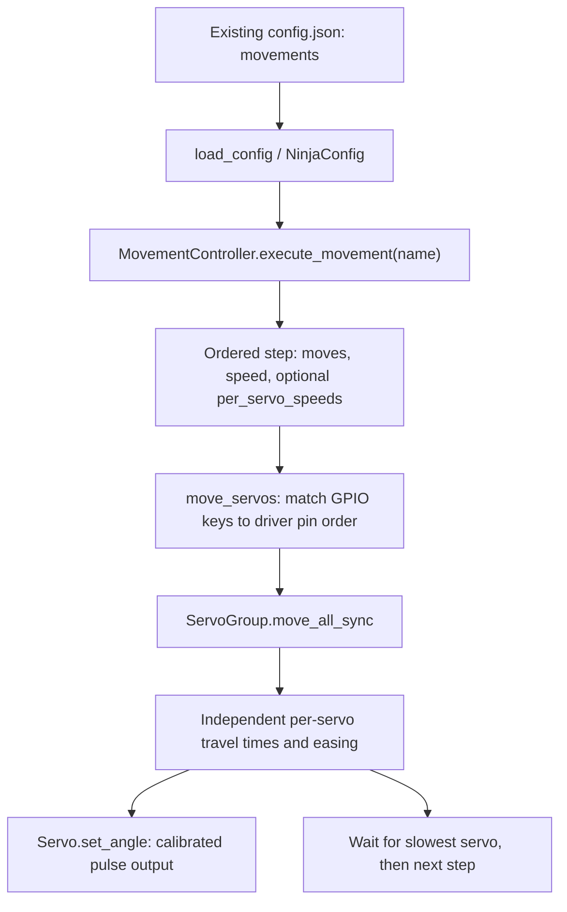

# NinjaRobotPi0 Spider: OTTO waypoint movement library

Date: 2026-10-09. Status: implemented as an **opt-in, offline-generated JSON pack**; host validation only. No existing movement-control function, driver, API, runtime config, or calibration was changed. This library follows the corrected joint mapping supplied by the owner.

This document describes what works with the current executor. [Pi0BuildinMovementsRefinement.md](Pi0BuildinMovementsRefinement.md) separately evaluates a future timed/oscillator controller; none of its proposed fields or functions are implemented here.

## 1. Movement System Overview

### Existing execution path

`config.json` contains a `movements` object: each name maps to an ordered list of steps. `NinjaConfig.movements` is `Dict[str, list]`, so the config model validates that outer shape but does **not** deeply validate every step. The recorder writes steps, saves the configuration, and the controller reads `config.movements`. The web movement list/execute endpoints and movement CLI use the same controller. There is no automatic directory scan for the new pack.



The pack is [ninja_core/movements/spider_otto.json](../ninja_core/movements/spider_otto.json). Its only root keys are existing fields `robot_type: "spider"` and `movements`. It has no pretend calibration profile. It loads through `load_config(path)` as a config fragment, but cannot operate an actual robot on its own because it deliberately supplies no servo calibration/pins. It is not installed or merged into the live configuration by this task.

### Current behavior, verified from code

| Aspect | Actual behavior |
|---|---|
| `moves` | Object of string GPIO numbers to numeric angles; executor converts keys to int |
| `speed` | Required by `execute_movement`; use existing `F`, `M`, `S` modes |
| `per_servo_speeds` | Optional string-GPIO-to-mode object, overrides speed for a commanded servo |
| Omitted GPIO | Target is `None`; that servo is skipped, retaining its previous command/state |
| Unknown GPIO | This controller silently omits it because it iterates driver pins; the pack tests ensure exact pins, but deployment must have all eight |
| Multi-servo step | Starts a shared software loop; each servo has its own duration; not synchronized arrival |
| Steps | Executed sequentially; next starts after the longest duration of the current step |
| Easing | One step: in/out cubic; first of many: in cubic; middle: linear; last: out cubic |
| Duration | Calculated from angular distance, calibration speed percentage, and F/M/S multiplier |
| Delay/repeat/oscillator | No fields consumed by the current executor; adding such JSON keys would not implement them |
| Final state | Last targets remain commanded; executor does not automatically home or release |

The driver uses a 0.01 s update interval. Its nominal calculation is:

`velocity = 600 × (calibration.speed / 100) × mode_multiplier` degrees/second,

where F=1, M=0.75, S=0.5; `duration = abs(target − previous_angle) / velocity`. These are driver calculations, not measured motor performance. Cubic easing changes instantaneous speed: that formula is not a hard peak-velocity limit. A missing cached angle falls back to driver pulse-to-angle reading and then calibration center, not a joint encoder.

Sources: [config.py](../ninja_core/src/ninja_core/config.py), `NinjaConfig`, `load_config`, `save_config`; [movement_controller.py](../ninja_core/src/ninja_core/movement_controller.py), `move_servos` and `execute_movement`; [multi_servos.py](../pi0servo/src/pi0servo/core/multi_servos.py), `move_all_sync`; [calculator.py](../pi0servo/src/pi0servo/motion/calculator.py), `calculate_duration`.

## 2. How to Control Servos

These are compatible **movement entries inside `config.movements`**, not commands automatically executed by reading this document. Numeric angles are targets, not measured joint angles. The examples use M, the target system's existing default mode; it is not a conversion of an OTTO period.

### One servo

```json
{
  "example_one": [
    {"moves": {"20": 20}, "speed": "M"}
  ]
}
```

Only GPIO20 is commanded. Other servos retain their previous state; an omitted servo is not automatically attached or centered.

### Several servos in one step, with an optional override

```json
{
  "example_group": [
    {
      "moves": {"20": 20, "21": -20},
      "speed": "S",
      "per_servo_speeds": {"21": "F"}
    }
  ]
}
```

GPIO20 uses Slow and GPIO21 Fast. Each advances from its existing angle; the faster one may finish first. The controller waits for both before returning. Speed overrides on pins absent from `moves` do not command those pins.

### Ordered sequence

```json
{
  "example_sequence": [
    {"moves": {"20": 20, "21": -20}, "speed": "M"},
    {"moves": {"20": 0}, "speed": "M"}
  ]
}
```

GPIO21 stays at its previous −20° command during the second step. There is no dwell between these steps. Repeating the same target does not create a reliable pause: the driver sees zero angular distance and zero nominal duration.

### Loading the library without activating hardware

From the robot repository, this standard-library snippet creates a **preview file only**, preserving other configuration fields and refusing name collisions. It does not import the HAL or operate hardware. Inspect the result locally; it can contain existing private settings and must not be published.

```python
import json
from pathlib import Path

existing = json.loads(Path("config.json").read_text())
pack = json.loads(Path("ninja_core/movements/spider_otto.json").read_text())
if existing.get("robot_type") != "spider":
    raise ValueError("Use a configured Spider profile; do not change another robot implicitly")
missing = set(map(str, range(20, 28))) - set(existing.get("servos", {}).get("calibration", {}))
if missing:
    raise ValueError("Missing servo configuration for one or more Spider GPIOs")
# Convert the source pack names to the names used in this document.
incoming = {
    "spider_" + name.removeprefix("spider_otto_"): steps
    for name, steps in pack["movements"].items()
}
incoming["Poweroff"] = [{
    "speed": "S",
    "moves": {"20": -90, "21": 90, "22": 90, "23": -90,
              "24": 90, "25": -90, "26": -90, "27": 90},
    "per_servo_speeds": {}
}]
current = existing.setdefault("movements", {})
if set(current) & set(incoming):
    raise ValueError("Resolve movement-name collisions before merging")
current.update(incoming)
with Path("config-spider-preview.json").open("x") as output:
    json.dump(existing, output, indent=2)
```

Presence of calibration keys is not proof of physical calibration. Runtime uses `servo.json` through the HAL's `ConfigManager`, so inspect actual pulse endpoints, angle bounds, speed limits, mounting, and all eight connected pins before any later activation. Replacing the live config/restarting the server is a separate deliberate deployment step, not performed here. The library does not automatically become available to CLI/web/AI simply by existing in its directory.

## 3. Spider Hardware and Servo Mapping

BCM GPIO numbers below are **not physical header pin numbers or list indices**. Joint labels come from the owner's corrected mapping. Current Pi0 defaults independently support GPIO20–27; no inspected Pi0 code/manual binds those numbers to different named hips/feet. The hardware placement therefore remains owner-specified rather than physically measured in this task.

| Pi0 BCM GPIO | Physical joint | OTTO ID | Source nominal range | Target nominal range |
|---|---|---|---|---|
| 20 | Left rear hip | S5 | 0…180° | −90…+90° |
| 21 | Right rear hip | S4 | 0…180° | −90…+90° |
| 22 | Left rear foot | S7 | 0…180° | −90…+90° |
| 23 | Right rear foot | S6 | 0…180° | −90…+90° |
| 24 | Left front hip | S1 | 0…180° | −90…+90° |
| 25 | Right front hip | S0 | 0…180° | −90…+90° |
| 26 | Left front foot | S3 | 0…180° | −90…+90° |
| 27 | Right front foot | S2 | 0…180° | −90…+90° |

The source-index-to-GPIO vector is `[25,24,27,26,21,20,23,22]`. The target controller orders commands by its driver pin list, so JSON insertion order must never be treated as physical servo identity. Tests deliberately shuffle that pin list.

The existing InstallationGuide specifies an external servo supply and common ground with the Pi, rather than powering the servo group from the Pi's 5 V header rail. The source OTTO supply diagram does not establish an adequate Pi0 supply current. No wiring, power, mesh, or mounting test was performed in this implementation task.

Runtime calibration comes from [hal.py](../ninja_core/src/ninja_core/hal.py), `_init_servos`, and [ConfigManager.get_calibration](../pi0servo/src/pi0servo/config/config_manager.py). Pi0's core config and standalone driver have different default pulse behavior: the driver dataclass's absent calibration uses 1500/1500/1500, while a present but incomplete config entry can default to 500/1500/2500. Neither is evidence of a calibrated physical build. Do not substitute source EEPROM trim or nominal defaults for measured Pi0 calibration.

## 4. Angle Conversion

The implemented nominal conversion is:

`target_GPIO[source_id] = source_logical_angle − 90°`.

Thus 90→0, 45→−45, 110→20. The untrimmed home vector becomes:

```json
{
  "moves": {"20": 20, "21": -20, "22": 0, "23": 0, "24": -20, "25": 20, "26": 0, "27": 0},
  "speed": "M"
}
```

This is an OTTO-derived stance, **not** Pi0's all-zero center pose.

### Corrections intentionally not assumed

- The OTTO sketch reverses S2 after initial home: its actual motor write is `180−(q2+trim2)`. That is evidence about the source build, not evidence that GPIO27 on the owner's Pi0 should be reversed. This nominal port does not copy that mounting-specific correction. For example, waveHAND's phase-zero q2=30 becomes GPIO27=−60 here; literal source motor-write translation with zero trim would be +60. Direction compatibility is therefore explicitly unverified.
- Source EEPROM trims are unknown and not portable; generated values use zero source trim. Pi0 calibration independently maps signed angles to pulse widths. Home's source double-trim bug is not imported.
- Only hello's logical S1 wave falls below the nominal source range. The generator clamps q to 0…180 before subtracting 90, explicitly giving −90 at its lower endpoint; otherwise that source −10 would become −100. This is a documented range adaptation. It is not evidence that a −90° physical endpoint is mechanically safe.
- No generic `invert`, `offset`, or `duration` fields have been added to the existing JSON schema.

The driver clamps to its configured angular bounds and interpolates between calibrated pulse endpoints on either side of center. Its cached `last_angle` is the requested angle, which may differ from the clamped physical command. Narrower robot limits can therefore alter a movement even though every pack value passes the nominal ±90 check.

## 5. Complete Built-in Movement Library

### Translation convention and fidelity

There are **19 OTTO-derived entries covering 16 original movement/pose functions**, plus the owner-supplied **`Poweroff`** pose: **20 documented movements and 566 total steps**. Run, walk, and omniWalk each have two entries for their direction/side variants. The omni defaults produce identical waveform samples; those names preserve source call selection, not distinct physical trajectories. Internal helpers are not separate movements.

Every periodic entry represents **one finite logical cycle**, with 36 equal phase intervals plus the initial endpoint: 37 waypoints. Each waypoint commands all eight mapped servos. This 10° phase sampling is an explicit approximation choice, not OTTO's refresh interval. Targets use `O + A sin(2πct/P + phase)` sampled by phase, rounded to 0.001°. For walk the foot frequency multiplier c is 2. That gives 18 samples per foot cycle. No source `steps` argument is treated as a reliable stop condition; most OTTO functions ignore it.

The JSON cannot carry the listed source periods: each step uses native M and its actual duration depends on distances, previous pose, calibration, and easing. Intermediate joint phases can diverge because servos arrive independently. These definitions preserve **ordered target poses**, not exact temporal coordination, duty cycle, velocity, foot support, or continuous locomotion. They are not physical qualification for floor walking.

All sine entries finish at the mathematical phase-zero endpoint after one cycle, holding the final command rather than automatically returning home. OTTO normally keeps oscillating. Repeated invocations add first/last-step easing and are not seamless oscillator continuation. Startup transition comes from the robot's existing position; no unrequested neutral step is inserted.

### Complete coverage table

The 19 OTTO-derived names below use prefix `spider_`. The linked source pack still uses `spider_otto_`; this document intentionally uses the renamed keys. The preview merge in section 2 converts that prefix. `Poweroff` is an additional document-defined movement and keeps its exact case-sensitive name. “Validated” means schema-shape, numerical, mapping, and mocked-executor validation; **all hardware tests remain pending**.

| Name suffix | Original function / purpose | Phases and varying joints | Source period or waits | Adaptation / status |
|---|---|---|---|---|
| home | home: reference stance | 1 all-servo pose | Immediate source write | Nominal pose; no source detach/double trim; validated |
| run_forward | run(0): forward-labeled gait | 37; all joints | 550 ms cycle | Finite sampled cycle; validated |
| run_backward | run(1): reverse-labeled gait | 37; all joints, opposite hip phases | 550 ms cycle | Direction variant; validated |
| turn_left | turnL | 37; all joints | 550 ms cycle | Opposed hip phases; validated |
| turn_right | turnR | 37; all joints | 550 ms cycle | Opposite turn pattern; validated |
| dance | dance: staggered foot waves | 37; feet vary, hips fixed | Serial 1000 ms; API default 2000 | Serial angular pattern; no period preservation; validated |
| front_back | frontBack: coordinated hip/foot rocking | 37; all joints | Serial 750 ms; API default 2000 | Same angles for both period choices; validated |
| up_down | upDown: foot bending | 37; feet vary, hips fixed | 500 ms cycle | Body-height effect unverified; validated |
| push_up | pushUp: front-foot bending | 37; S2/S3 vary, other targets fixed | 5000 ms cycle | Rear hips at 25/155 source degrees; validated |
| wave_hand | waveHAND | 37; only S2/GPIO27 varies | 700 ms cycle | Negative amplitude retained; no unverified target inversion; validated |
| hide | Hide: folded-like pose | 1 all-servo pose | Source zero amplitudes, nominal T=700 | Constant target, no continuous rewrite; validated |
| moonwalk_left | moonwalkL | 37; four feet vary at staggered phases | 2000 ms cycle | Includes 120°/290° phases; validated |
| omni_true | omniWalk(true,1000,2) | 37; all joints | 1000 ms cycle | Source default f=2, not silently changed to f=1; validated |
| omni_false | omniWalk(false,1000,2) | 37; all joints | 1000 ms cycle | Equivalent default samples to omni_true; validated |
| walk_forward | walk(1) | 37; feet cycle twice per hip cycle | 550 ms hips, 275 feet | All joints updated, reflecting pause's refresh; finite cycle, not default four-cycle blocking loop; validated |
| walk_backward | walk(0) | 37; reversed hip phases | Same periods | Direction variant; validated |
| jump | jump: folded/stretch/home | 3 all-servo poses | Source waits 1000,100 ms | Waits unsupported/omitted; target interpolates instead of immediate writes; validated |
| scared | scared: stretch/folded/home | 3 all-servo poses | Source waits 2000,100 ms | Same timing loss; reversed pose order; validated |
| hello | hello: small helper writes and front-left wave | 2 helper-derived waypoints + 37 wave samples | Wave 350 ms; helper total duration uptime-dependent | Partial, state-dependent source cannot be reproduced exactly; numerical/loader validated |
| Poweroff | Owner-supplied shutdown pose, not an OTTO function | 1 all-servo pose | Native S; distance-derived duration | Exact case-sensitive shutdown lookup name; no physical validation |

`walk`, `moonwalkL`, and `hello` are independently callable source methods even though not exposed by OTTO's gait menu. Four expression wrappers only add home poses/display changes and are not duplicated as movement trajectories. Autonomous obstacle/dance modes are policies composing movements and sensors, not additional independently defined joint patterns; their scheduling is outside this finite JSON pack.

Arbitrary continuous parameter values (steps/T/turn_factor) are not infinitely enumerated. The pack covers the named/default variants above. For example, f=0 or f=1 in omniWalk requires regenerating parameter-derived poses for an explicitly chosen variant; the existing JSON cannot accept a runtime factor. Source formulas remain available in the generator and OTTO reference.

### Complete copyable JSON for every movement

Each block below is a complete JSON **configuration fragment** containing one named movement. Copy the named `spider_*` or `Poweroff` entry into the `movements` object of your existing Spider `config.json`; preserve your other configuration fields, servo calibration and other movements. Do not replace your full robot configuration with a fragment. The preview-merge example in section 2 shows how to merge the complete library without activating hardware.

After deliberately loading the updated configuration in your normal Pi0 runtime, select the exact movement name in the existing movement tool or web movement list. Each invocation plays the listed sequence once. These blocks contain every waypoint and all eight GPIO targets; there are no omitted steps or placeholders. The 19 OTTO-derived sequences have identical step values to `ninja_core/movements/spider_otto.json`, with names changed from `spider_otto_*` to `spider_*`. The additional `Poweroff` definition is provided below and is not in that source pack.

The OTTO-derived steps use native `M` speed; `Poweroff` uses native `S`. The JSON reproduces the translated target-pose sequence; the existing executor does not preserve OTTO's exact cycle periods or pauses. Use the calibrated Spider mapping described above; physical direction and clearance remain unverified. In particular, jump/scared omit source waits and hello remains a partial adaptation.

#### 1. spider_home

Complete sequence: 1 step.

```json
{
  "robot_type": "spider",
  "movements": {
    "spider_home": [
      {"moves": {"20": 20.0, "21": -20.0, "22": 0.0, "23": 0.0, "24": -20.0, "25": 20.0, "26": 0.0, "27": 0.0}, "speed": "M"}
    ]
  }
}
```

#### 2. spider_run_forward

Complete sequence: 37 steps.

```json
{
  "robot_type": "spider",
  "movements": {
    "spider_run_forward": [
      {"moves": {"20": 15.0, "21": -15.0, "22": 15.0, "23": 15.0, "24": -15.0, "25": 15.0, "26": 15.0, "27": 15.0}, "speed": "M"},
      {"moves": {"20": 12.395, "21": -17.605, "22": 14.772, "23": 14.772, "24": -12.395, "25": 17.605, "26": 14.772, "27": 14.772}, "speed": "M"},
      {"moves": {"20": 9.87, "21": -20.13, "22": 14.095, "23": 14.095, "24": -9.87, "25": 20.13, "26": 14.095, "27": 14.095}, "speed": "M"},
      {"moves": {"20": 7.5, "21": -22.5, "22": 12.99, "23": 12.99, "24": -7.5, "25": 22.5, "26": 12.99, "27": 12.99}, "speed": "M"},
      {"moves": {"20": 5.358, "21": -24.642, "22": 11.491, "23": 11.491, "24": -5.358, "25": 24.642, "26": 11.491, "27": 11.491}, "speed": "M"},
      {"moves": {"20": 3.509, "21": -26.491, "22": 9.642, "23": 9.642, "24": -3.509, "25": 26.491, "26": 9.642, "27": 9.642}, "speed": "M"},
      {"moves": {"20": 2.01, "21": -27.99, "22": 7.5, "23": 7.5, "24": -2.01, "25": 27.99, "26": 7.5, "27": 7.5}, "speed": "M"},
      {"moves": {"20": 0.905, "21": -29.095, "22": 5.13, "23": 5.13, "24": -0.905, "25": 29.095, "26": 5.13, "27": 5.13}, "speed": "M"},
      {"moves": {"20": 0.228, "21": -29.772, "22": 2.605, "23": 2.605, "24": -0.228, "25": 29.772, "26": 2.605, "27": 2.605}, "speed": "M"},
      {"moves": {"20": 0.0, "21": -30.0, "22": 0.0, "23": 0.0, "24": 0.0, "25": 30.0, "26": 0.0, "27": 0.0}, "speed": "M"},
      {"moves": {"20": 0.228, "21": -29.772, "22": -2.605, "23": -2.605, "24": -0.228, "25": 29.772, "26": -2.605, "27": -2.605}, "speed": "M"},
      {"moves": {"20": 0.905, "21": -29.095, "22": -5.13, "23": -5.13, "24": -0.905, "25": 29.095, "26": -5.13, "27": -5.13}, "speed": "M"},
      {"moves": {"20": 2.01, "21": -27.99, "22": -7.5, "23": -7.5, "24": -2.01, "25": 27.99, "26": -7.5, "27": -7.5}, "speed": "M"},
      {"moves": {"20": 3.509, "21": -26.491, "22": -9.642, "23": -9.642, "24": -3.509, "25": 26.491, "26": -9.642, "27": -9.642}, "speed": "M"},
      {"moves": {"20": 5.358, "21": -24.642, "22": -11.491, "23": -11.491, "24": -5.358, "25": 24.642, "26": -11.491, "27": -11.491}, "speed": "M"},
      {"moves": {"20": 7.5, "21": -22.5, "22": -12.99, "23": -12.99, "24": -7.5, "25": 22.5, "26": -12.99, "27": -12.99}, "speed": "M"},
      {"moves": {"20": 9.87, "21": -20.13, "22": -14.095, "23": -14.095, "24": -9.87, "25": 20.13, "26": -14.095, "27": -14.095}, "speed": "M"},
      {"moves": {"20": 12.395, "21": -17.605, "22": -14.772, "23": -14.772, "24": -12.395, "25": 17.605, "26": -14.772, "27": -14.772}, "speed": "M"},
      {"moves": {"20": 15.0, "21": -15.0, "22": -15.0, "23": -15.0, "24": -15.0, "25": 15.0, "26": -15.0, "27": -15.0}, "speed": "M"},
      {"moves": {"20": 17.605, "21": -12.395, "22": -14.772, "23": -14.772, "24": -17.605, "25": 12.395, "26": -14.772, "27": -14.772}, "speed": "M"},
      {"moves": {"20": 20.13, "21": -9.87, "22": -14.095, "23": -14.095, "24": -20.13, "25": 9.87, "26": -14.095, "27": -14.095}, "speed": "M"},
      {"moves": {"20": 22.5, "21": -7.5, "22": -12.99, "23": -12.99, "24": -22.5, "25": 7.5, "26": -12.99, "27": -12.99}, "speed": "M"},
      {"moves": {"20": 24.642, "21": -5.358, "22": -11.491, "23": -11.491, "24": -24.642, "25": 5.358, "26": -11.491, "27": -11.491}, "speed": "M"},
      {"moves": {"20": 26.491, "21": -3.509, "22": -9.642, "23": -9.642, "24": -26.491, "25": 3.509, "26": -9.642, "27": -9.642}, "speed": "M"},
      {"moves": {"20": 27.99, "21": -2.01, "22": -7.5, "23": -7.5, "24": -27.99, "25": 2.01, "26": -7.5, "27": -7.5}, "speed": "M"},
      {"moves": {"20": 29.095, "21": -0.905, "22": -5.13, "23": -5.13, "24": -29.095, "25": 0.905, "26": -5.13, "27": -5.13}, "speed": "M"},
      {"moves": {"20": 29.772, "21": -0.228, "22": -2.605, "23": -2.605, "24": -29.772, "25": 0.228, "26": -2.605, "27": -2.605}, "speed": "M"},
      {"moves": {"20": 30.0, "21": 0.0, "22": 0.0, "23": 0.0, "24": -30.0, "25": 0.0, "26": 0.0, "27": 0.0}, "speed": "M"},
      {"moves": {"20": 29.772, "21": -0.228, "22": 2.605, "23": 2.605, "24": -29.772, "25": 0.228, "26": 2.605, "27": 2.605}, "speed": "M"},
      {"moves": {"20": 29.095, "21": -0.905, "22": 5.13, "23": 5.13, "24": -29.095, "25": 0.905, "26": 5.13, "27": 5.13}, "speed": "M"},
      {"moves": {"20": 27.99, "21": -2.01, "22": 7.5, "23": 7.5, "24": -27.99, "25": 2.01, "26": 7.5, "27": 7.5}, "speed": "M"},
      {"moves": {"20": 26.491, "21": -3.509, "22": 9.642, "23": 9.642, "24": -26.491, "25": 3.509, "26": 9.642, "27": 9.642}, "speed": "M"},
      {"moves": {"20": 24.642, "21": -5.358, "22": 11.491, "23": 11.491, "24": -24.642, "25": 5.358, "26": 11.491, "27": 11.491}, "speed": "M"},
      {"moves": {"20": 22.5, "21": -7.5, "22": 12.99, "23": 12.99, "24": -22.5, "25": 7.5, "26": 12.99, "27": 12.99}, "speed": "M"},
      {"moves": {"20": 20.13, "21": -9.87, "22": 14.095, "23": 14.095, "24": -20.13, "25": 9.87, "26": 14.095, "27": 14.095}, "speed": "M"},
      {"moves": {"20": 17.605, "21": -12.395, "22": 14.772, "23": 14.772, "24": -17.605, "25": 12.395, "26": 14.772, "27": 14.772}, "speed": "M"},
      {"moves": {"20": 15.0, "21": -15.0, "22": 15.0, "23": 15.0, "24": -15.0, "25": 15.0, "26": 15.0, "27": 15.0}, "speed": "M"}
    ]
  }
}
```

#### 3. spider_run_backward

Complete sequence: 37 steps.

```json
{
  "robot_type": "spider",
  "movements": {
    "spider_run_backward": [
      {"moves": {"20": 15.0, "21": -15.0, "22": 15.0, "23": 15.0, "24": -15.0, "25": 15.0, "26": 15.0, "27": 15.0}, "speed": "M"},
      {"moves": {"20": 17.605, "21": -12.395, "22": 14.772, "23": 14.772, "24": -17.605, "25": 12.395, "26": 14.772, "27": 14.772}, "speed": "M"},
      {"moves": {"20": 20.13, "21": -9.87, "22": 14.095, "23": 14.095, "24": -20.13, "25": 9.87, "26": 14.095, "27": 14.095}, "speed": "M"},
      {"moves": {"20": 22.5, "21": -7.5, "22": 12.99, "23": 12.99, "24": -22.5, "25": 7.5, "26": 12.99, "27": 12.99}, "speed": "M"},
      {"moves": {"20": 24.642, "21": -5.358, "22": 11.491, "23": 11.491, "24": -24.642, "25": 5.358, "26": 11.491, "27": 11.491}, "speed": "M"},
      {"moves": {"20": 26.491, "21": -3.509, "22": 9.642, "23": 9.642, "24": -26.491, "25": 3.509, "26": 9.642, "27": 9.642}, "speed": "M"},
      {"moves": {"20": 27.99, "21": -2.01, "22": 7.5, "23": 7.5, "24": -27.99, "25": 2.01, "26": 7.5, "27": 7.5}, "speed": "M"},
      {"moves": {"20": 29.095, "21": -0.905, "22": 5.13, "23": 5.13, "24": -29.095, "25": 0.905, "26": 5.13, "27": 5.13}, "speed": "M"},
      {"moves": {"20": 29.772, "21": -0.228, "22": 2.605, "23": 2.605, "24": -29.772, "25": 0.228, "26": 2.605, "27": 2.605}, "speed": "M"},
      {"moves": {"20": 30.0, "21": 0.0, "22": 0.0, "23": 0.0, "24": -30.0, "25": 0.0, "26": 0.0, "27": 0.0}, "speed": "M"},
      {"moves": {"20": 29.772, "21": -0.228, "22": -2.605, "23": -2.605, "24": -29.772, "25": 0.228, "26": -2.605, "27": -2.605}, "speed": "M"},
      {"moves": {"20": 29.095, "21": -0.905, "22": -5.13, "23": -5.13, "24": -29.095, "25": 0.905, "26": -5.13, "27": -5.13}, "speed": "M"},
      {"moves": {"20": 27.99, "21": -2.01, "22": -7.5, "23": -7.5, "24": -27.99, "25": 2.01, "26": -7.5, "27": -7.5}, "speed": "M"},
      {"moves": {"20": 26.491, "21": -3.509, "22": -9.642, "23": -9.642, "24": -26.491, "25": 3.509, "26": -9.642, "27": -9.642}, "speed": "M"},
      {"moves": {"20": 24.642, "21": -5.358, "22": -11.491, "23": -11.491, "24": -24.642, "25": 5.358, "26": -11.491, "27": -11.491}, "speed": "M"},
      {"moves": {"20": 22.5, "21": -7.5, "22": -12.99, "23": -12.99, "24": -22.5, "25": 7.5, "26": -12.99, "27": -12.99}, "speed": "M"},
      {"moves": {"20": 20.13, "21": -9.87, "22": -14.095, "23": -14.095, "24": -20.13, "25": 9.87, "26": -14.095, "27": -14.095}, "speed": "M"},
      {"moves": {"20": 17.605, "21": -12.395, "22": -14.772, "23": -14.772, "24": -17.605, "25": 12.395, "26": -14.772, "27": -14.772}, "speed": "M"},
      {"moves": {"20": 15.0, "21": -15.0, "22": -15.0, "23": -15.0, "24": -15.0, "25": 15.0, "26": -15.0, "27": -15.0}, "speed": "M"},
      {"moves": {"20": 12.395, "21": -17.605, "22": -14.772, "23": -14.772, "24": -12.395, "25": 17.605, "26": -14.772, "27": -14.772}, "speed": "M"},
      {"moves": {"20": 9.87, "21": -20.13, "22": -14.095, "23": -14.095, "24": -9.87, "25": 20.13, "26": -14.095, "27": -14.095}, "speed": "M"},
      {"moves": {"20": 7.5, "21": -22.5, "22": -12.99, "23": -12.99, "24": -7.5, "25": 22.5, "26": -12.99, "27": -12.99}, "speed": "M"},
      {"moves": {"20": 5.358, "21": -24.642, "22": -11.491, "23": -11.491, "24": -5.358, "25": 24.642, "26": -11.491, "27": -11.491}, "speed": "M"},
      {"moves": {"20": 3.509, "21": -26.491, "22": -9.642, "23": -9.642, "24": -3.509, "25": 26.491, "26": -9.642, "27": -9.642}, "speed": "M"},
      {"moves": {"20": 2.01, "21": -27.99, "22": -7.5, "23": -7.5, "24": -2.01, "25": 27.99, "26": -7.5, "27": -7.5}, "speed": "M"},
      {"moves": {"20": 0.905, "21": -29.095, "22": -5.13, "23": -5.13, "24": -0.905, "25": 29.095, "26": -5.13, "27": -5.13}, "speed": "M"},
      {"moves": {"20": 0.228, "21": -29.772, "22": -2.605, "23": -2.605, "24": -0.228, "25": 29.772, "26": -2.605, "27": -2.605}, "speed": "M"},
      {"moves": {"20": 0.0, "21": -30.0, "22": 0.0, "23": 0.0, "24": 0.0, "25": 30.0, "26": 0.0, "27": 0.0}, "speed": "M"},
      {"moves": {"20": 0.228, "21": -29.772, "22": 2.605, "23": 2.605, "24": -0.228, "25": 29.772, "26": 2.605, "27": 2.605}, "speed": "M"},
      {"moves": {"20": 0.905, "21": -29.095, "22": 5.13, "23": 5.13, "24": -0.905, "25": 29.095, "26": 5.13, "27": 5.13}, "speed": "M"},
      {"moves": {"20": 2.01, "21": -27.99, "22": 7.5, "23": 7.5, "24": -2.01, "25": 27.99, "26": 7.5, "27": 7.5}, "speed": "M"},
      {"moves": {"20": 3.509, "21": -26.491, "22": 9.642, "23": 9.642, "24": -3.509, "25": 26.491, "26": 9.642, "27": 9.642}, "speed": "M"},
      {"moves": {"20": 5.358, "21": -24.642, "22": 11.491, "23": 11.491, "24": -5.358, "25": 24.642, "26": 11.491, "27": 11.491}, "speed": "M"},
      {"moves": {"20": 7.5, "21": -22.5, "22": 12.99, "23": 12.99, "24": -7.5, "25": 22.5, "26": 12.99, "27": 12.99}, "speed": "M"},
      {"moves": {"20": 9.87, "21": -20.13, "22": 14.095, "23": 14.095, "24": -9.87, "25": 20.13, "26": 14.095, "27": 14.095}, "speed": "M"},
      {"moves": {"20": 12.395, "21": -17.605, "22": 14.772, "23": 14.772, "24": -12.395, "25": 17.605, "26": 14.772, "27": 14.772}, "speed": "M"},
      {"moves": {"20": 15.0, "21": -15.0, "22": 15.0, "23": 15.0, "24": -15.0, "25": 15.0, "26": 15.0, "27": 15.0}, "speed": "M"}
    ]
  }
}
```

#### 4. spider_turn_left

Complete sequence: 37 steps.

```json
{
  "robot_type": "spider",
  "movements": {
    "spider_turn_left": [
      {"moves": {"20": 15.0, "21": -15.0, "22": 15.0, "23": 15.0, "24": -15.0, "25": 15.0, "26": 15.0, "27": 15.0}, "speed": "M"},
      {"moves": {"20": 17.605, "21": -17.605, "22": 14.772, "23": 14.772, "24": -17.605, "25": 17.605, "26": 14.772, "27": 14.772}, "speed": "M"},
      {"moves": {"20": 20.13, "21": -20.13, "22": 14.095, "23": 14.095, "24": -20.13, "25": 20.13, "26": 14.095, "27": 14.095}, "speed": "M"},
      {"moves": {"20": 22.5, "21": -22.5, "22": 12.99, "23": 12.99, "24": -22.5, "25": 22.5, "26": 12.99, "27": 12.99}, "speed": "M"},
      {"moves": {"20": 24.642, "21": -24.642, "22": 11.491, "23": 11.491, "24": -24.642, "25": 24.642, "26": 11.491, "27": 11.491}, "speed": "M"},
      {"moves": {"20": 26.491, "21": -26.491, "22": 9.642, "23": 9.642, "24": -26.491, "25": 26.491, "26": 9.642, "27": 9.642}, "speed": "M"},
      {"moves": {"20": 27.99, "21": -27.99, "22": 7.5, "23": 7.5, "24": -27.99, "25": 27.99, "26": 7.5, "27": 7.5}, "speed": "M"},
      {"moves": {"20": 29.095, "21": -29.095, "22": 5.13, "23": 5.13, "24": -29.095, "25": 29.095, "26": 5.13, "27": 5.13}, "speed": "M"},
      {"moves": {"20": 29.772, "21": -29.772, "22": 2.605, "23": 2.605, "24": -29.772, "25": 29.772, "26": 2.605, "27": 2.605}, "speed": "M"},
      {"moves": {"20": 30.0, "21": -30.0, "22": 0.0, "23": 0.0, "24": -30.0, "25": 30.0, "26": 0.0, "27": 0.0}, "speed": "M"},
      {"moves": {"20": 29.772, "21": -29.772, "22": -2.605, "23": -2.605, "24": -29.772, "25": 29.772, "26": -2.605, "27": -2.605}, "speed": "M"},
      {"moves": {"20": 29.095, "21": -29.095, "22": -5.13, "23": -5.13, "24": -29.095, "25": 29.095, "26": -5.13, "27": -5.13}, "speed": "M"},
      {"moves": {"20": 27.99, "21": -27.99, "22": -7.5, "23": -7.5, "24": -27.99, "25": 27.99, "26": -7.5, "27": -7.5}, "speed": "M"},
      {"moves": {"20": 26.491, "21": -26.491, "22": -9.642, "23": -9.642, "24": -26.491, "25": 26.491, "26": -9.642, "27": -9.642}, "speed": "M"},
      {"moves": {"20": 24.642, "21": -24.642, "22": -11.491, "23": -11.491, "24": -24.642, "25": 24.642, "26": -11.491, "27": -11.491}, "speed": "M"},
      {"moves": {"20": 22.5, "21": -22.5, "22": -12.99, "23": -12.99, "24": -22.5, "25": 22.5, "26": -12.99, "27": -12.99}, "speed": "M"},
      {"moves": {"20": 20.13, "21": -20.13, "22": -14.095, "23": -14.095, "24": -20.13, "25": 20.13, "26": -14.095, "27": -14.095}, "speed": "M"},
      {"moves": {"20": 17.605, "21": -17.605, "22": -14.772, "23": -14.772, "24": -17.605, "25": 17.605, "26": -14.772, "27": -14.772}, "speed": "M"},
      {"moves": {"20": 15.0, "21": -15.0, "22": -15.0, "23": -15.0, "24": -15.0, "25": 15.0, "26": -15.0, "27": -15.0}, "speed": "M"},
      {"moves": {"20": 12.395, "21": -12.395, "22": -14.772, "23": -14.772, "24": -12.395, "25": 12.395, "26": -14.772, "27": -14.772}, "speed": "M"},
      {"moves": {"20": 9.87, "21": -9.87, "22": -14.095, "23": -14.095, "24": -9.87, "25": 9.87, "26": -14.095, "27": -14.095}, "speed": "M"},
      {"moves": {"20": 7.5, "21": -7.5, "22": -12.99, "23": -12.99, "24": -7.5, "25": 7.5, "26": -12.99, "27": -12.99}, "speed": "M"},
      {"moves": {"20": 5.358, "21": -5.358, "22": -11.491, "23": -11.491, "24": -5.358, "25": 5.358, "26": -11.491, "27": -11.491}, "speed": "M"},
      {"moves": {"20": 3.509, "21": -3.509, "22": -9.642, "23": -9.642, "24": -3.509, "25": 3.509, "26": -9.642, "27": -9.642}, "speed": "M"},
      {"moves": {"20": 2.01, "21": -2.01, "22": -7.5, "23": -7.5, "24": -2.01, "25": 2.01, "26": -7.5, "27": -7.5}, "speed": "M"},
      {"moves": {"20": 0.905, "21": -0.905, "22": -5.13, "23": -5.13, "24": -0.905, "25": 0.905, "26": -5.13, "27": -5.13}, "speed": "M"},
      {"moves": {"20": 0.228, "21": -0.228, "22": -2.605, "23": -2.605, "24": -0.228, "25": 0.228, "26": -2.605, "27": -2.605}, "speed": "M"},
      {"moves": {"20": 0.0, "21": 0.0, "22": 0.0, "23": 0.0, "24": 0.0, "25": 0.0, "26": 0.0, "27": 0.0}, "speed": "M"},
      {"moves": {"20": 0.228, "21": -0.228, "22": 2.605, "23": 2.605, "24": -0.228, "25": 0.228, "26": 2.605, "27": 2.605}, "speed": "M"},
      {"moves": {"20": 0.905, "21": -0.905, "22": 5.13, "23": 5.13, "24": -0.905, "25": 0.905, "26": 5.13, "27": 5.13}, "speed": "M"},
      {"moves": {"20": 2.01, "21": -2.01, "22": 7.5, "23": 7.5, "24": -2.01, "25": 2.01, "26": 7.5, "27": 7.5}, "speed": "M"},
      {"moves": {"20": 3.509, "21": -3.509, "22": 9.642, "23": 9.642, "24": -3.509, "25": 3.509, "26": 9.642, "27": 9.642}, "speed": "M"},
      {"moves": {"20": 5.358, "21": -5.358, "22": 11.491, "23": 11.491, "24": -5.358, "25": 5.358, "26": 11.491, "27": 11.491}, "speed": "M"},
      {"moves": {"20": 7.5, "21": -7.5, "22": 12.99, "23": 12.99, "24": -7.5, "25": 7.5, "26": 12.99, "27": 12.99}, "speed": "M"},
      {"moves": {"20": 9.87, "21": -9.87, "22": 14.095, "23": 14.095, "24": -9.87, "25": 9.87, "26": 14.095, "27": 14.095}, "speed": "M"},
      {"moves": {"20": 12.395, "21": -12.395, "22": 14.772, "23": 14.772, "24": -12.395, "25": 12.395, "26": 14.772, "27": 14.772}, "speed": "M"},
      {"moves": {"20": 15.0, "21": -15.0, "22": 15.0, "23": 15.0, "24": -15.0, "25": 15.0, "26": 15.0, "27": 15.0}, "speed": "M"}
    ]
  }
}
```

#### 5. spider_turn_right

Complete sequence: 37 steps.

```json
{
  "robot_type": "spider",
  "movements": {
    "spider_turn_right": [
      {"moves": {"20": 15.0, "21": -15.0, "22": 15.0, "23": 15.0, "24": -15.0, "25": 15.0, "26": 15.0, "27": 15.0}, "speed": "M"},
      {"moves": {"20": 12.395, "21": -12.395, "22": 14.772, "23": 14.772, "24": -12.395, "25": 12.395, "26": 14.772, "27": 14.772}, "speed": "M"},
      {"moves": {"20": 9.87, "21": -9.87, "22": 14.095, "23": 14.095, "24": -9.87, "25": 9.87, "26": 14.095, "27": 14.095}, "speed": "M"},
      {"moves": {"20": 7.5, "21": -7.5, "22": 12.99, "23": 12.99, "24": -7.5, "25": 7.5, "26": 12.99, "27": 12.99}, "speed": "M"},
      {"moves": {"20": 5.358, "21": -5.358, "22": 11.491, "23": 11.491, "24": -5.358, "25": 5.358, "26": 11.491, "27": 11.491}, "speed": "M"},
      {"moves": {"20": 3.509, "21": -3.509, "22": 9.642, "23": 9.642, "24": -3.509, "25": 3.509, "26": 9.642, "27": 9.642}, "speed": "M"},
      {"moves": {"20": 2.01, "21": -2.01, "22": 7.5, "23": 7.5, "24": -2.01, "25": 2.01, "26": 7.5, "27": 7.5}, "speed": "M"},
      {"moves": {"20": 0.905, "21": -0.905, "22": 5.13, "23": 5.13, "24": -0.905, "25": 0.905, "26": 5.13, "27": 5.13}, "speed": "M"},
      {"moves": {"20": 0.228, "21": -0.228, "22": 2.605, "23": 2.605, "24": -0.228, "25": 0.228, "26": 2.605, "27": 2.605}, "speed": "M"},
      {"moves": {"20": 0.0, "21": 0.0, "22": 0.0, "23": 0.0, "24": 0.0, "25": 0.0, "26": 0.0, "27": 0.0}, "speed": "M"},
      {"moves": {"20": 0.228, "21": -0.228, "22": -2.605, "23": -2.605, "24": -0.228, "25": 0.228, "26": -2.605, "27": -2.605}, "speed": "M"},
      {"moves": {"20": 0.905, "21": -0.905, "22": -5.13, "23": -5.13, "24": -0.905, "25": 0.905, "26": -5.13, "27": -5.13}, "speed": "M"},
      {"moves": {"20": 2.01, "21": -2.01, "22": -7.5, "23": -7.5, "24": -2.01, "25": 2.01, "26": -7.5, "27": -7.5}, "speed": "M"},
      {"moves": {"20": 3.509, "21": -3.509, "22": -9.642, "23": -9.642, "24": -3.509, "25": 3.509, "26": -9.642, "27": -9.642}, "speed": "M"},
      {"moves": {"20": 5.358, "21": -5.358, "22": -11.491, "23": -11.491, "24": -5.358, "25": 5.358, "26": -11.491, "27": -11.491}, "speed": "M"},
      {"moves": {"20": 7.5, "21": -7.5, "22": -12.99, "23": -12.99, "24": -7.5, "25": 7.5, "26": -12.99, "27": -12.99}, "speed": "M"},
      {"moves": {"20": 9.87, "21": -9.87, "22": -14.095, "23": -14.095, "24": -9.87, "25": 9.87, "26": -14.095, "27": -14.095}, "speed": "M"},
      {"moves": {"20": 12.395, "21": -12.395, "22": -14.772, "23": -14.772, "24": -12.395, "25": 12.395, "26": -14.772, "27": -14.772}, "speed": "M"},
      {"moves": {"20": 15.0, "21": -15.0, "22": -15.0, "23": -15.0, "24": -15.0, "25": 15.0, "26": -15.0, "27": -15.0}, "speed": "M"},
      {"moves": {"20": 17.605, "21": -17.605, "22": -14.772, "23": -14.772, "24": -17.605, "25": 17.605, "26": -14.772, "27": -14.772}, "speed": "M"},
      {"moves": {"20": 20.13, "21": -20.13, "22": -14.095, "23": -14.095, "24": -20.13, "25": 20.13, "26": -14.095, "27": -14.095}, "speed": "M"},
      {"moves": {"20": 22.5, "21": -22.5, "22": -12.99, "23": -12.99, "24": -22.5, "25": 22.5, "26": -12.99, "27": -12.99}, "speed": "M"},
      {"moves": {"20": 24.642, "21": -24.642, "22": -11.491, "23": -11.491, "24": -24.642, "25": 24.642, "26": -11.491, "27": -11.491}, "speed": "M"},
      {"moves": {"20": 26.491, "21": -26.491, "22": -9.642, "23": -9.642, "24": -26.491, "25": 26.491, "26": -9.642, "27": -9.642}, "speed": "M"},
      {"moves": {"20": 27.99, "21": -27.99, "22": -7.5, "23": -7.5, "24": -27.99, "25": 27.99, "26": -7.5, "27": -7.5}, "speed": "M"},
      {"moves": {"20": 29.095, "21": -29.095, "22": -5.13, "23": -5.13, "24": -29.095, "25": 29.095, "26": -5.13, "27": -5.13}, "speed": "M"},
      {"moves": {"20": 29.772, "21": -29.772, "22": -2.605, "23": -2.605, "24": -29.772, "25": 29.772, "26": -2.605, "27": -2.605}, "speed": "M"},
      {"moves": {"20": 30.0, "21": -30.0, "22": 0.0, "23": 0.0, "24": -30.0, "25": 30.0, "26": 0.0, "27": 0.0}, "speed": "M"},
      {"moves": {"20": 29.772, "21": -29.772, "22": 2.605, "23": 2.605, "24": -29.772, "25": 29.772, "26": 2.605, "27": 2.605}, "speed": "M"},
      {"moves": {"20": 29.095, "21": -29.095, "22": 5.13, "23": 5.13, "24": -29.095, "25": 29.095, "26": 5.13, "27": 5.13}, "speed": "M"},
      {"moves": {"20": 27.99, "21": -27.99, "22": 7.5, "23": 7.5, "24": -27.99, "25": 27.99, "26": 7.5, "27": 7.5}, "speed": "M"},
      {"moves": {"20": 26.491, "21": -26.491, "22": 9.642, "23": 9.642, "24": -26.491, "25": 26.491, "26": 9.642, "27": 9.642}, "speed": "M"},
      {"moves": {"20": 24.642, "21": -24.642, "22": 11.491, "23": 11.491, "24": -24.642, "25": 24.642, "26": 11.491, "27": 11.491}, "speed": "M"},
      {"moves": {"20": 22.5, "21": -22.5, "22": 12.99, "23": 12.99, "24": -22.5, "25": 22.5, "26": 12.99, "27": 12.99}, "speed": "M"},
      {"moves": {"20": 20.13, "21": -20.13, "22": 14.095, "23": 14.095, "24": -20.13, "25": 20.13, "26": 14.095, "27": 14.095}, "speed": "M"},
      {"moves": {"20": 17.605, "21": -17.605, "22": 14.772, "23": 14.772, "24": -17.605, "25": 17.605, "26": 14.772, "27": 14.772}, "speed": "M"},
      {"moves": {"20": 15.0, "21": -15.0, "22": 15.0, "23": 15.0, "24": -15.0, "25": 15.0, "26": 15.0, "27": 15.0}, "speed": "M"}
    ]
  }
}
```

#### 6. spider_dance

Complete sequence: 37 steps.

```json
{
  "robot_type": "spider",
  "movements": {
    "spider_dance": [
      {"moves": {"20": 30.0, "21": -30.0, "22": 0.0, "23": 40.0, "24": -30.0, "25": 30.0, "26": -40.0, "27": 0.0}, "speed": "M"},
      {"moves": {"20": 30.0, "21": -30.0, "22": -6.946, "23": 39.392, "24": -30.0, "25": 30.0, "26": -39.392, "27": 6.946}, "speed": "M"},
      {"moves": {"20": 30.0, "21": -30.0, "22": -13.681, "23": 37.588, "24": -30.0, "25": 30.0, "26": -37.588, "27": 13.681}, "speed": "M"},
      {"moves": {"20": 30.0, "21": -30.0, "22": -20.0, "23": 34.641, "24": -30.0, "25": 30.0, "26": -34.641, "27": 20.0}, "speed": "M"},
      {"moves": {"20": 30.0, "21": -30.0, "22": -25.712, "23": 30.642, "24": -30.0, "25": 30.0, "26": -30.642, "27": 25.712}, "speed": "M"},
      {"moves": {"20": 30.0, "21": -30.0, "22": -30.642, "23": 25.712, "24": -30.0, "25": 30.0, "26": -25.712, "27": 30.642}, "speed": "M"},
      {"moves": {"20": 30.0, "21": -30.0, "22": -34.641, "23": 20.0, "24": -30.0, "25": 30.0, "26": -20.0, "27": 34.641}, "speed": "M"},
      {"moves": {"20": 30.0, "21": -30.0, "22": -37.588, "23": 13.681, "24": -30.0, "25": 30.0, "26": -13.681, "27": 37.588}, "speed": "M"},
      {"moves": {"20": 30.0, "21": -30.0, "22": -39.392, "23": 6.946, "24": -30.0, "25": 30.0, "26": -6.946, "27": 39.392}, "speed": "M"},
      {"moves": {"20": 30.0, "21": -30.0, "22": -40.0, "23": 0.0, "24": -30.0, "25": 30.0, "26": 0.0, "27": 40.0}, "speed": "M"},
      {"moves": {"20": 30.0, "21": -30.0, "22": -39.392, "23": -6.946, "24": -30.0, "25": 30.0, "26": 6.946, "27": 39.392}, "speed": "M"},
      {"moves": {"20": 30.0, "21": -30.0, "22": -37.588, "23": -13.681, "24": -30.0, "25": 30.0, "26": 13.681, "27": 37.588}, "speed": "M"},
      {"moves": {"20": 30.0, "21": -30.0, "22": -34.641, "23": -20.0, "24": -30.0, "25": 30.0, "26": 20.0, "27": 34.641}, "speed": "M"},
      {"moves": {"20": 30.0, "21": -30.0, "22": -30.642, "23": -25.712, "24": -30.0, "25": 30.0, "26": 25.712, "27": 30.642}, "speed": "M"},
      {"moves": {"20": 30.0, "21": -30.0, "22": -25.712, "23": -30.642, "24": -30.0, "25": 30.0, "26": 30.642, "27": 25.712}, "speed": "M"},
      {"moves": {"20": 30.0, "21": -30.0, "22": -20.0, "23": -34.641, "24": -30.0, "25": 30.0, "26": 34.641, "27": 20.0}, "speed": "M"},
      {"moves": {"20": 30.0, "21": -30.0, "22": -13.681, "23": -37.588, "24": -30.0, "25": 30.0, "26": 37.588, "27": 13.681}, "speed": "M"},
      {"moves": {"20": 30.0, "21": -30.0, "22": -6.946, "23": -39.392, "24": -30.0, "25": 30.0, "26": 39.392, "27": 6.946}, "speed": "M"},
      {"moves": {"20": 30.0, "21": -30.0, "22": 0.0, "23": -40.0, "24": -30.0, "25": 30.0, "26": 40.0, "27": 0.0}, "speed": "M"},
      {"moves": {"20": 30.0, "21": -30.0, "22": 6.946, "23": -39.392, "24": -30.0, "25": 30.0, "26": 39.392, "27": -6.946}, "speed": "M"},
      {"moves": {"20": 30.0, "21": -30.0, "22": 13.681, "23": -37.588, "24": -30.0, "25": 30.0, "26": 37.588, "27": -13.681}, "speed": "M"},
      {"moves": {"20": 30.0, "21": -30.0, "22": 20.0, "23": -34.641, "24": -30.0, "25": 30.0, "26": 34.641, "27": -20.0}, "speed": "M"},
      {"moves": {"20": 30.0, "21": -30.0, "22": 25.712, "23": -30.642, "24": -30.0, "25": 30.0, "26": 30.642, "27": -25.712}, "speed": "M"},
      {"moves": {"20": 30.0, "21": -30.0, "22": 30.642, "23": -25.712, "24": -30.0, "25": 30.0, "26": 25.712, "27": -30.642}, "speed": "M"},
      {"moves": {"20": 30.0, "21": -30.0, "22": 34.641, "23": -20.0, "24": -30.0, "25": 30.0, "26": 20.0, "27": -34.641}, "speed": "M"},
      {"moves": {"20": 30.0, "21": -30.0, "22": 37.588, "23": -13.681, "24": -30.0, "25": 30.0, "26": 13.681, "27": -37.588}, "speed": "M"},
      {"moves": {"20": 30.0, "21": -30.0, "22": 39.392, "23": -6.946, "24": -30.0, "25": 30.0, "26": 6.946, "27": -39.392}, "speed": "M"},
      {"moves": {"20": 30.0, "21": -30.0, "22": 40.0, "23": 0.0, "24": -30.0, "25": 30.0, "26": 0.0, "27": -40.0}, "speed": "M"},
      {"moves": {"20": 30.0, "21": -30.0, "22": 39.392, "23": 6.946, "24": -30.0, "25": 30.0, "26": -6.946, "27": -39.392}, "speed": "M"},
      {"moves": {"20": 30.0, "21": -30.0, "22": 37.588, "23": 13.681, "24": -30.0, "25": 30.0, "26": -13.681, "27": -37.588}, "speed": "M"},
      {"moves": {"20": 30.0, "21": -30.0, "22": 34.641, "23": 20.0, "24": -30.0, "25": 30.0, "26": -20.0, "27": -34.641}, "speed": "M"},
      {"moves": {"20": 30.0, "21": -30.0, "22": 30.642, "23": 25.712, "24": -30.0, "25": 30.0, "26": -25.712, "27": -30.642}, "speed": "M"},
      {"moves": {"20": 30.0, "21": -30.0, "22": 25.712, "23": 30.642, "24": -30.0, "25": 30.0, "26": -30.642, "27": -25.712}, "speed": "M"},
      {"moves": {"20": 30.0, "21": -30.0, "22": 20.0, "23": 34.641, "24": -30.0, "25": 30.0, "26": -34.641, "27": -20.0}, "speed": "M"},
      {"moves": {"20": 30.0, "21": -30.0, "22": 13.681, "23": 37.588, "24": -30.0, "25": 30.0, "26": -37.588, "27": -13.681}, "speed": "M"},
      {"moves": {"20": 30.0, "21": -30.0, "22": 6.946, "23": 39.392, "24": -30.0, "25": 30.0, "26": -39.392, "27": -6.946}, "speed": "M"},
      {"moves": {"20": 30.0, "21": -30.0, "22": 0.0, "23": 40.0, "24": -30.0, "25": 30.0, "26": -40.0, "27": 0.0}, "speed": "M"}
    ]
  }
}
```

#### 7. spider_front_back

Complete sequence: 37 steps.

```json
{
  "robot_type": "spider",
  "movements": {
    "spider_front_back": [
      {"moves": {"20": 20.0, "21": -20.0, "22": -25.0, "23": 25.0, "24": -20.0, "25": 20.0, "26": 25.0, "27": -25.0}, "speed": "M"},
      {"moves": {"20": 14.791, "21": -14.791, "22": -24.62, "23": 24.62, "24": -25.209, "25": 25.209, "26": 24.62, "27": -24.62}, "speed": "M"},
      {"moves": {"20": 9.739, "21": -9.739, "22": -23.492, "23": 23.492, "24": -30.261, "25": 30.261, "26": 23.492, "27": -23.492}, "speed": "M"},
      {"moves": {"20": 5.0, "21": -5.0, "22": -21.651, "23": 21.651, "24": -35.0, "25": 35.0, "26": 21.651, "27": -21.651}, "speed": "M"},
      {"moves": {"20": 0.716, "21": -0.716, "22": -19.151, "23": 19.151, "24": -39.284, "25": 39.284, "26": 19.151, "27": -19.151}, "speed": "M"},
      {"moves": {"20": -2.981, "21": 2.981, "22": -16.07, "23": 16.07, "24": -42.981, "25": 42.981, "26": 16.07, "27": -16.07}, "speed": "M"},
      {"moves": {"20": -5.981, "21": 5.981, "22": -12.5, "23": 12.5, "24": -45.981, "25": 45.981, "26": 12.5, "27": -12.5}, "speed": "M"},
      {"moves": {"20": -8.191, "21": 8.191, "22": -8.551, "23": 8.551, "24": -48.191, "25": 48.191, "26": 8.551, "27": -8.551}, "speed": "M"},
      {"moves": {"20": -9.544, "21": 9.544, "22": -4.341, "23": 4.341, "24": -49.544, "25": 49.544, "26": 4.341, "27": -4.341}, "speed": "M"},
      {"moves": {"20": -10.0, "21": 10.0, "22": 0.0, "23": 0.0, "24": -50.0, "25": 50.0, "26": 0.0, "27": 0.0}, "speed": "M"},
      {"moves": {"20": -9.544, "21": 9.544, "22": 4.341, "23": -4.341, "24": -49.544, "25": 49.544, "26": -4.341, "27": 4.341}, "speed": "M"},
      {"moves": {"20": -8.191, "21": 8.191, "22": 8.551, "23": -8.551, "24": -48.191, "25": 48.191, "26": -8.551, "27": 8.551}, "speed": "M"},
      {"moves": {"20": -5.981, "21": 5.981, "22": 12.5, "23": -12.5, "24": -45.981, "25": 45.981, "26": -12.5, "27": 12.5}, "speed": "M"},
      {"moves": {"20": -2.981, "21": 2.981, "22": 16.07, "23": -16.07, "24": -42.981, "25": 42.981, "26": -16.07, "27": 16.07}, "speed": "M"},
      {"moves": {"20": 0.716, "21": -0.716, "22": 19.151, "23": -19.151, "24": -39.284, "25": 39.284, "26": -19.151, "27": 19.151}, "speed": "M"},
      {"moves": {"20": 5.0, "21": -5.0, "22": 21.651, "23": -21.651, "24": -35.0, "25": 35.0, "26": -21.651, "27": 21.651}, "speed": "M"},
      {"moves": {"20": 9.739, "21": -9.739, "22": 23.492, "23": -23.492, "24": -30.261, "25": 30.261, "26": -23.492, "27": 23.492}, "speed": "M"},
      {"moves": {"20": 14.791, "21": -14.791, "22": 24.62, "23": -24.62, "24": -25.209, "25": 25.209, "26": -24.62, "27": 24.62}, "speed": "M"},
      {"moves": {"20": 20.0, "21": -20.0, "22": 25.0, "23": -25.0, "24": -20.0, "25": 20.0, "26": -25.0, "27": 25.0}, "speed": "M"},
      {"moves": {"20": 25.209, "21": -25.209, "22": 24.62, "23": -24.62, "24": -14.791, "25": 14.791, "26": -24.62, "27": 24.62}, "speed": "M"},
      {"moves": {"20": 30.261, "21": -30.261, "22": 23.492, "23": -23.492, "24": -9.739, "25": 9.739, "26": -23.492, "27": 23.492}, "speed": "M"},
      {"moves": {"20": 35.0, "21": -35.0, "22": 21.651, "23": -21.651, "24": -5.0, "25": 5.0, "26": -21.651, "27": 21.651}, "speed": "M"},
      {"moves": {"20": 39.284, "21": -39.284, "22": 19.151, "23": -19.151, "24": -0.716, "25": 0.716, "26": -19.151, "27": 19.151}, "speed": "M"},
      {"moves": {"20": 42.981, "21": -42.981, "22": 16.07, "23": -16.07, "24": 2.981, "25": -2.981, "26": -16.07, "27": 16.07}, "speed": "M"},
      {"moves": {"20": 45.981, "21": -45.981, "22": 12.5, "23": -12.5, "24": 5.981, "25": -5.981, "26": -12.5, "27": 12.5}, "speed": "M"},
      {"moves": {"20": 48.191, "21": -48.191, "22": 8.551, "23": -8.551, "24": 8.191, "25": -8.191, "26": -8.551, "27": 8.551}, "speed": "M"},
      {"moves": {"20": 49.544, "21": -49.544, "22": 4.341, "23": -4.341, "24": 9.544, "25": -9.544, "26": -4.341, "27": 4.341}, "speed": "M"},
      {"moves": {"20": 50.0, "21": -50.0, "22": 0.0, "23": 0.0, "24": 10.0, "25": -10.0, "26": 0.0, "27": 0.0}, "speed": "M"},
      {"moves": {"20": 49.544, "21": -49.544, "22": -4.341, "23": 4.341, "24": 9.544, "25": -9.544, "26": 4.341, "27": -4.341}, "speed": "M"},
      {"moves": {"20": 48.191, "21": -48.191, "22": -8.551, "23": 8.551, "24": 8.191, "25": -8.191, "26": 8.551, "27": -8.551}, "speed": "M"},
      {"moves": {"20": 45.981, "21": -45.981, "22": -12.5, "23": 12.5, "24": 5.981, "25": -5.981, "26": 12.5, "27": -12.5}, "speed": "M"},
      {"moves": {"20": 42.981, "21": -42.981, "22": -16.07, "23": 16.07, "24": 2.981, "25": -2.981, "26": 16.07, "27": -16.07}, "speed": "M"},
      {"moves": {"20": 39.284, "21": -39.284, "22": -19.151, "23": 19.151, "24": -0.716, "25": 0.716, "26": 19.151, "27": -19.151}, "speed": "M"},
      {"moves": {"20": 35.0, "21": -35.0, "22": -21.651, "23": 21.651, "24": -5.0, "25": 5.0, "26": 21.651, "27": -21.651}, "speed": "M"},
      {"moves": {"20": 30.261, "21": -30.261, "22": -23.492, "23": 23.492, "24": -9.739, "25": 9.739, "26": 23.492, "27": -23.492}, "speed": "M"},
      {"moves": {"20": 25.209, "21": -25.209, "22": -24.62, "23": 24.62, "24": -14.791, "25": 14.791, "26": 24.62, "27": -24.62}, "speed": "M"},
      {"moves": {"20": 20.0, "21": -20.0, "22": -25.0, "23": 25.0, "24": -20.0, "25": 20.0, "26": 25.0, "27": -25.0}, "speed": "M"}
    ]
  }
}
```

#### 8. spider_up_down

Complete sequence: 37 steps.

```json
{
  "robot_type": "spider",
  "movements": {
    "spider_up_down": [
      {"moves": {"20": 20.0, "21": -20.0, "22": 35.0, "23": -35.0, "24": -20.0, "25": 20.0, "26": -35.0, "27": 35.0}, "speed": "M"},
      {"moves": {"20": 20.0, "21": -20.0, "22": 34.468, "23": -34.468, "24": -20.0, "25": 20.0, "26": -34.468, "27": 34.468}, "speed": "M"},
      {"moves": {"20": 20.0, "21": -20.0, "22": 32.889, "23": -32.889, "24": -20.0, "25": 20.0, "26": -32.889, "27": 32.889}, "speed": "M"},
      {"moves": {"20": 20.0, "21": -20.0, "22": 30.311, "23": -30.311, "24": -20.0, "25": 20.0, "26": -30.311, "27": 30.311}, "speed": "M"},
      {"moves": {"20": 20.0, "21": -20.0, "22": 26.812, "23": -26.812, "24": -20.0, "25": 20.0, "26": -26.812, "27": 26.812}, "speed": "M"},
      {"moves": {"20": 20.0, "21": -20.0, "22": 22.498, "23": -22.498, "24": -20.0, "25": 20.0, "26": -22.498, "27": 22.498}, "speed": "M"},
      {"moves": {"20": 20.0, "21": -20.0, "22": 17.5, "23": -17.5, "24": -20.0, "25": 20.0, "26": -17.5, "27": 17.5}, "speed": "M"},
      {"moves": {"20": 20.0, "21": -20.0, "22": 11.971, "23": -11.971, "24": -20.0, "25": 20.0, "26": -11.971, "27": 11.971}, "speed": "M"},
      {"moves": {"20": 20.0, "21": -20.0, "22": 6.078, "23": -6.078, "24": -20.0, "25": 20.0, "26": -6.078, "27": 6.078}, "speed": "M"},
      {"moves": {"20": 20.0, "21": -20.0, "22": 0.0, "23": 0.0, "24": -20.0, "25": 20.0, "26": 0.0, "27": 0.0}, "speed": "M"},
      {"moves": {"20": 20.0, "21": -20.0, "22": -6.078, "23": 6.078, "24": -20.0, "25": 20.0, "26": 6.078, "27": -6.078}, "speed": "M"},
      {"moves": {"20": 20.0, "21": -20.0, "22": -11.971, "23": 11.971, "24": -20.0, "25": 20.0, "26": 11.971, "27": -11.971}, "speed": "M"},
      {"moves": {"20": 20.0, "21": -20.0, "22": -17.5, "23": 17.5, "24": -20.0, "25": 20.0, "26": 17.5, "27": -17.5}, "speed": "M"},
      {"moves": {"20": 20.0, "21": -20.0, "22": -22.498, "23": 22.498, "24": -20.0, "25": 20.0, "26": 22.498, "27": -22.498}, "speed": "M"},
      {"moves": {"20": 20.0, "21": -20.0, "22": -26.812, "23": 26.812, "24": -20.0, "25": 20.0, "26": 26.812, "27": -26.812}, "speed": "M"},
      {"moves": {"20": 20.0, "21": -20.0, "22": -30.311, "23": 30.311, "24": -20.0, "25": 20.0, "26": 30.311, "27": -30.311}, "speed": "M"},
      {"moves": {"20": 20.0, "21": -20.0, "22": -32.889, "23": 32.889, "24": -20.0, "25": 20.0, "26": 32.889, "27": -32.889}, "speed": "M"},
      {"moves": {"20": 20.0, "21": -20.0, "22": -34.468, "23": 34.468, "24": -20.0, "25": 20.0, "26": 34.468, "27": -34.468}, "speed": "M"},
      {"moves": {"20": 20.0, "21": -20.0, "22": -35.0, "23": 35.0, "24": -20.0, "25": 20.0, "26": 35.0, "27": -35.0}, "speed": "M"},
      {"moves": {"20": 20.0, "21": -20.0, "22": -34.468, "23": 34.468, "24": -20.0, "25": 20.0, "26": 34.468, "27": -34.468}, "speed": "M"},
      {"moves": {"20": 20.0, "21": -20.0, "22": -32.889, "23": 32.889, "24": -20.0, "25": 20.0, "26": 32.889, "27": -32.889}, "speed": "M"},
      {"moves": {"20": 20.0, "21": -20.0, "22": -30.311, "23": 30.311, "24": -20.0, "25": 20.0, "26": 30.311, "27": -30.311}, "speed": "M"},
      {"moves": {"20": 20.0, "21": -20.0, "22": -26.812, "23": 26.812, "24": -20.0, "25": 20.0, "26": 26.812, "27": -26.812}, "speed": "M"},
      {"moves": {"20": 20.0, "21": -20.0, "22": -22.498, "23": 22.498, "24": -20.0, "25": 20.0, "26": 22.498, "27": -22.498}, "speed": "M"},
      {"moves": {"20": 20.0, "21": -20.0, "22": -17.5, "23": 17.5, "24": -20.0, "25": 20.0, "26": 17.5, "27": -17.5}, "speed": "M"},
      {"moves": {"20": 20.0, "21": -20.0, "22": -11.971, "23": 11.971, "24": -20.0, "25": 20.0, "26": 11.971, "27": -11.971}, "speed": "M"},
      {"moves": {"20": 20.0, "21": -20.0, "22": -6.078, "23": 6.078, "24": -20.0, "25": 20.0, "26": 6.078, "27": -6.078}, "speed": "M"},
      {"moves": {"20": 20.0, "21": -20.0, "22": 0.0, "23": 0.0, "24": -20.0, "25": 20.0, "26": 0.0, "27": 0.0}, "speed": "M"},
      {"moves": {"20": 20.0, "21": -20.0, "22": 6.078, "23": -6.078, "24": -20.0, "25": 20.0, "26": -6.078, "27": 6.078}, "speed": "M"},
      {"moves": {"20": 20.0, "21": -20.0, "22": 11.971, "23": -11.971, "24": -20.0, "25": 20.0, "26": -11.971, "27": 11.971}, "speed": "M"},
      {"moves": {"20": 20.0, "21": -20.0, "22": 17.5, "23": -17.5, "24": -20.0, "25": 20.0, "26": -17.5, "27": 17.5}, "speed": "M"},
      {"moves": {"20": 20.0, "21": -20.0, "22": 22.498, "23": -22.498, "24": -20.0, "25": 20.0, "26": -22.498, "27": 22.498}, "speed": "M"},
      {"moves": {"20": 20.0, "21": -20.0, "22": 26.812, "23": -26.812, "24": -20.0, "25": 20.0, "26": -26.812, "27": 26.812}, "speed": "M"},
      {"moves": {"20": 20.0, "21": -20.0, "22": 30.311, "23": -30.311, "24": -20.0, "25": 20.0, "26": -30.311, "27": 30.311}, "speed": "M"},
      {"moves": {"20": 20.0, "21": -20.0, "22": 32.889, "23": -32.889, "24": -20.0, "25": 20.0, "26": -32.889, "27": 32.889}, "speed": "M"},
      {"moves": {"20": 20.0, "21": -20.0, "22": 34.468, "23": -34.468, "24": -20.0, "25": 20.0, "26": -34.468, "27": 34.468}, "speed": "M"},
      {"moves": {"20": 20.0, "21": -20.0, "22": 35.0, "23": -35.0, "24": -20.0, "25": 20.0, "26": -35.0, "27": 35.0}, "speed": "M"}
    ]
  }
}
```

#### 9. spider_push_up

Complete sequence: 37 steps.

```json
{
  "robot_type": "spider",
  "movements": {
    "spider_push_up": [
      {"moves": {"20": 65.0, "21": -65.0, "22": 0.0, "23": 0.0, "24": 0.0, "25": 0.0, "26": 0.0, "27": 0.0}, "speed": "M"},
      {"moves": {"20": 65.0, "21": -65.0, "22": 0.0, "23": 0.0, "24": 0.0, "25": 0.0, "26": -6.946, "27": 6.946}, "speed": "M"},
      {"moves": {"20": 65.0, "21": -65.0, "22": 0.0, "23": 0.0, "24": 0.0, "25": 0.0, "26": -13.681, "27": 13.681}, "speed": "M"},
      {"moves": {"20": 65.0, "21": -65.0, "22": 0.0, "23": 0.0, "24": 0.0, "25": 0.0, "26": -20.0, "27": 20.0}, "speed": "M"},
      {"moves": {"20": 65.0, "21": -65.0, "22": 0.0, "23": 0.0, "24": 0.0, "25": 0.0, "26": -25.712, "27": 25.712}, "speed": "M"},
      {"moves": {"20": 65.0, "21": -65.0, "22": 0.0, "23": 0.0, "24": 0.0, "25": 0.0, "26": -30.642, "27": 30.642}, "speed": "M"},
      {"moves": {"20": 65.0, "21": -65.0, "22": 0.0, "23": 0.0, "24": 0.0, "25": 0.0, "26": -34.641, "27": 34.641}, "speed": "M"},
      {"moves": {"20": 65.0, "21": -65.0, "22": 0.0, "23": 0.0, "24": 0.0, "25": 0.0, "26": -37.588, "27": 37.588}, "speed": "M"},
      {"moves": {"20": 65.0, "21": -65.0, "22": 0.0, "23": 0.0, "24": 0.0, "25": 0.0, "26": -39.392, "27": 39.392}, "speed": "M"},
      {"moves": {"20": 65.0, "21": -65.0, "22": 0.0, "23": 0.0, "24": 0.0, "25": 0.0, "26": -40.0, "27": 40.0}, "speed": "M"},
      {"moves": {"20": 65.0, "21": -65.0, "22": 0.0, "23": 0.0, "24": 0.0, "25": 0.0, "26": -39.392, "27": 39.392}, "speed": "M"},
      {"moves": {"20": 65.0, "21": -65.0, "22": 0.0, "23": 0.0, "24": 0.0, "25": 0.0, "26": -37.588, "27": 37.588}, "speed": "M"},
      {"moves": {"20": 65.0, "21": -65.0, "22": 0.0, "23": 0.0, "24": 0.0, "25": 0.0, "26": -34.641, "27": 34.641}, "speed": "M"},
      {"moves": {"20": 65.0, "21": -65.0, "22": 0.0, "23": 0.0, "24": 0.0, "25": 0.0, "26": -30.642, "27": 30.642}, "speed": "M"},
      {"moves": {"20": 65.0, "21": -65.0, "22": 0.0, "23": 0.0, "24": 0.0, "25": 0.0, "26": -25.712, "27": 25.712}, "speed": "M"},
      {"moves": {"20": 65.0, "21": -65.0, "22": 0.0, "23": 0.0, "24": 0.0, "25": 0.0, "26": -20.0, "27": 20.0}, "speed": "M"},
      {"moves": {"20": 65.0, "21": -65.0, "22": 0.0, "23": 0.0, "24": 0.0, "25": 0.0, "26": -13.681, "27": 13.681}, "speed": "M"},
      {"moves": {"20": 65.0, "21": -65.0, "22": 0.0, "23": 0.0, "24": 0.0, "25": 0.0, "26": -6.946, "27": 6.946}, "speed": "M"},
      {"moves": {"20": 65.0, "21": -65.0, "22": 0.0, "23": 0.0, "24": 0.0, "25": 0.0, "26": 0.0, "27": 0.0}, "speed": "M"},
      {"moves": {"20": 65.0, "21": -65.0, "22": 0.0, "23": 0.0, "24": 0.0, "25": 0.0, "26": 6.946, "27": -6.946}, "speed": "M"},
      {"moves": {"20": 65.0, "21": -65.0, "22": 0.0, "23": 0.0, "24": 0.0, "25": 0.0, "26": 13.681, "27": -13.681}, "speed": "M"},
      {"moves": {"20": 65.0, "21": -65.0, "22": 0.0, "23": 0.0, "24": 0.0, "25": 0.0, "26": 20.0, "27": -20.0}, "speed": "M"},
      {"moves": {"20": 65.0, "21": -65.0, "22": 0.0, "23": 0.0, "24": 0.0, "25": 0.0, "26": 25.712, "27": -25.712}, "speed": "M"},
      {"moves": {"20": 65.0, "21": -65.0, "22": 0.0, "23": 0.0, "24": 0.0, "25": 0.0, "26": 30.642, "27": -30.642}, "speed": "M"},
      {"moves": {"20": 65.0, "21": -65.0, "22": 0.0, "23": 0.0, "24": 0.0, "25": 0.0, "26": 34.641, "27": -34.641}, "speed": "M"},
      {"moves": {"20": 65.0, "21": -65.0, "22": 0.0, "23": 0.0, "24": 0.0, "25": 0.0, "26": 37.588, "27": -37.588}, "speed": "M"},
      {"moves": {"20": 65.0, "21": -65.0, "22": 0.0, "23": 0.0, "24": 0.0, "25": 0.0, "26": 39.392, "27": -39.392}, "speed": "M"},
      {"moves": {"20": 65.0, "21": -65.0, "22": 0.0, "23": 0.0, "24": 0.0, "25": 0.0, "26": 40.0, "27": -40.0}, "speed": "M"},
      {"moves": {"20": 65.0, "21": -65.0, "22": 0.0, "23": 0.0, "24": 0.0, "25": 0.0, "26": 39.392, "27": -39.392}, "speed": "M"},
      {"moves": {"20": 65.0, "21": -65.0, "22": 0.0, "23": 0.0, "24": 0.0, "25": 0.0, "26": 37.588, "27": -37.588}, "speed": "M"},
      {"moves": {"20": 65.0, "21": -65.0, "22": 0.0, "23": 0.0, "24": 0.0, "25": 0.0, "26": 34.641, "27": -34.641}, "speed": "M"},
      {"moves": {"20": 65.0, "21": -65.0, "22": 0.0, "23": 0.0, "24": 0.0, "25": 0.0, "26": 30.642, "27": -30.642}, "speed": "M"},
      {"moves": {"20": 65.0, "21": -65.0, "22": 0.0, "23": 0.0, "24": 0.0, "25": 0.0, "26": 25.712, "27": -25.712}, "speed": "M"},
      {"moves": {"20": 65.0, "21": -65.0, "22": 0.0, "23": 0.0, "24": 0.0, "25": 0.0, "26": 20.0, "27": -20.0}, "speed": "M"},
      {"moves": {"20": 65.0, "21": -65.0, "22": 0.0, "23": 0.0, "24": 0.0, "25": 0.0, "26": 13.681, "27": -13.681}, "speed": "M"},
      {"moves": {"20": 65.0, "21": -65.0, "22": 0.0, "23": 0.0, "24": 0.0, "25": 0.0, "26": 6.946, "27": -6.946}, "speed": "M"},
      {"moves": {"20": 65.0, "21": -65.0, "22": 0.0, "23": 0.0, "24": 0.0, "25": 0.0, "26": 0.0, "27": 0.0}, "speed": "M"}
    ]
  }
}
```

#### 10. spider_wave_hand

Complete sequence: 37 steps.

```json
{
  "robot_type": "spider",
  "movements": {
    "spider_wave_hand": [
      {"moves": {"20": 85.0, "21": -65.0, "22": 0.0, "23": 0.0, "24": 0.0, "25": 0.0, "26": -30.0, "27": -60.0}, "speed": "M"},
      {"moves": {"20": 85.0, "21": -65.0, "22": 0.0, "23": 0.0, "24": 0.0, "25": 0.0, "26": -30.0, "27": -63.473}, "speed": "M"},
      {"moves": {"20": 85.0, "21": -65.0, "22": 0.0, "23": 0.0, "24": 0.0, "25": 0.0, "26": -30.0, "27": -66.84}, "speed": "M"},
      {"moves": {"20": 85.0, "21": -65.0, "22": 0.0, "23": 0.0, "24": 0.0, "25": 0.0, "26": -30.0, "27": -70.0}, "speed": "M"},
      {"moves": {"20": 85.0, "21": -65.0, "22": 0.0, "23": 0.0, "24": 0.0, "25": 0.0, "26": -30.0, "27": -72.856}, "speed": "M"},
      {"moves": {"20": 85.0, "21": -65.0, "22": 0.0, "23": 0.0, "24": 0.0, "25": 0.0, "26": -30.0, "27": -75.321}, "speed": "M"},
      {"moves": {"20": 85.0, "21": -65.0, "22": 0.0, "23": 0.0, "24": 0.0, "25": 0.0, "26": -30.0, "27": -77.321}, "speed": "M"},
      {"moves": {"20": 85.0, "21": -65.0, "22": 0.0, "23": 0.0, "24": 0.0, "25": 0.0, "26": -30.0, "27": -78.794}, "speed": "M"},
      {"moves": {"20": 85.0, "21": -65.0, "22": 0.0, "23": 0.0, "24": 0.0, "25": 0.0, "26": -30.0, "27": -79.696}, "speed": "M"},
      {"moves": {"20": 85.0, "21": -65.0, "22": 0.0, "23": 0.0, "24": 0.0, "25": 0.0, "26": -30.0, "27": -80.0}, "speed": "M"},
      {"moves": {"20": 85.0, "21": -65.0, "22": 0.0, "23": 0.0, "24": 0.0, "25": 0.0, "26": -30.0, "27": -79.696}, "speed": "M"},
      {"moves": {"20": 85.0, "21": -65.0, "22": 0.0, "23": 0.0, "24": 0.0, "25": 0.0, "26": -30.0, "27": -78.794}, "speed": "M"},
      {"moves": {"20": 85.0, "21": -65.0, "22": 0.0, "23": 0.0, "24": 0.0, "25": 0.0, "26": -30.0, "27": -77.321}, "speed": "M"},
      {"moves": {"20": 85.0, "21": -65.0, "22": 0.0, "23": 0.0, "24": 0.0, "25": 0.0, "26": -30.0, "27": -75.321}, "speed": "M"},
      {"moves": {"20": 85.0, "21": -65.0, "22": 0.0, "23": 0.0, "24": 0.0, "25": 0.0, "26": -30.0, "27": -72.856}, "speed": "M"},
      {"moves": {"20": 85.0, "21": -65.0, "22": 0.0, "23": 0.0, "24": 0.0, "25": 0.0, "26": -30.0, "27": -70.0}, "speed": "M"},
      {"moves": {"20": 85.0, "21": -65.0, "22": 0.0, "23": 0.0, "24": 0.0, "25": 0.0, "26": -30.0, "27": -66.84}, "speed": "M"},
      {"moves": {"20": 85.0, "21": -65.0, "22": 0.0, "23": 0.0, "24": 0.0, "25": 0.0, "26": -30.0, "27": -63.473}, "speed": "M"},
      {"moves": {"20": 85.0, "21": -65.0, "22": 0.0, "23": 0.0, "24": 0.0, "25": 0.0, "26": -30.0, "27": -60.0}, "speed": "M"},
      {"moves": {"20": 85.0, "21": -65.0, "22": 0.0, "23": 0.0, "24": 0.0, "25": 0.0, "26": -30.0, "27": -56.527}, "speed": "M"},
      {"moves": {"20": 85.0, "21": -65.0, "22": 0.0, "23": 0.0, "24": 0.0, "25": 0.0, "26": -30.0, "27": -53.16}, "speed": "M"},
      {"moves": {"20": 85.0, "21": -65.0, "22": 0.0, "23": 0.0, "24": 0.0, "25": 0.0, "26": -30.0, "27": -50.0}, "speed": "M"},
      {"moves": {"20": 85.0, "21": -65.0, "22": 0.0, "23": 0.0, "24": 0.0, "25": 0.0, "26": -30.0, "27": -47.144}, "speed": "M"},
      {"moves": {"20": 85.0, "21": -65.0, "22": 0.0, "23": 0.0, "24": 0.0, "25": 0.0, "26": -30.0, "27": -44.679}, "speed": "M"},
      {"moves": {"20": 85.0, "21": -65.0, "22": 0.0, "23": 0.0, "24": 0.0, "25": 0.0, "26": -30.0, "27": -42.679}, "speed": "M"},
      {"moves": {"20": 85.0, "21": -65.0, "22": 0.0, "23": 0.0, "24": 0.0, "25": 0.0, "26": -30.0, "27": -41.206}, "speed": "M"},
      {"moves": {"20": 85.0, "21": -65.0, "22": 0.0, "23": 0.0, "24": 0.0, "25": 0.0, "26": -30.0, "27": -40.304}, "speed": "M"},
      {"moves": {"20": 85.0, "21": -65.0, "22": 0.0, "23": 0.0, "24": 0.0, "25": 0.0, "26": -30.0, "27": -40.0}, "speed": "M"},
      {"moves": {"20": 85.0, "21": -65.0, "22": 0.0, "23": 0.0, "24": 0.0, "25": 0.0, "26": -30.0, "27": -40.304}, "speed": "M"},
      {"moves": {"20": 85.0, "21": -65.0, "22": 0.0, "23": 0.0, "24": 0.0, "25": 0.0, "26": -30.0, "27": -41.206}, "speed": "M"},
      {"moves": {"20": 85.0, "21": -65.0, "22": 0.0, "23": 0.0, "24": 0.0, "25": 0.0, "26": -30.0, "27": -42.679}, "speed": "M"},
      {"moves": {"20": 85.0, "21": -65.0, "22": 0.0, "23": 0.0, "24": 0.0, "25": 0.0, "26": -30.0, "27": -44.679}, "speed": "M"},
      {"moves": {"20": 85.0, "21": -65.0, "22": 0.0, "23": 0.0, "24": 0.0, "25": 0.0, "26": -30.0, "27": -47.144}, "speed": "M"},
      {"moves": {"20": 85.0, "21": -65.0, "22": 0.0, "23": 0.0, "24": 0.0, "25": 0.0, "26": -30.0, "27": -50.0}, "speed": "M"},
      {"moves": {"20": 85.0, "21": -65.0, "22": 0.0, "23": 0.0, "24": 0.0, "25": 0.0, "26": -30.0, "27": -53.16}, "speed": "M"},
      {"moves": {"20": 85.0, "21": -65.0, "22": 0.0, "23": 0.0, "24": 0.0, "25": 0.0, "26": -30.0, "27": -56.527}, "speed": "M"},
      {"moves": {"20": 85.0, "21": -65.0, "22": 0.0, "23": 0.0, "24": 0.0, "25": 0.0, "26": -30.0, "27": -60.0}, "speed": "M"}
    ]
  }
}
```

#### 11. spider_hide

Complete sequence: 1 step.

```json
{
  "robot_type": "spider",
  "movements": {
    "spider_hide": [
      {"moves": {"20": 0.0, "21": 0.0, "22": -80.0, "23": 80.0, "24": 0.0, "25": 0.0, "26": 80.0, "27": -80.0}, "speed": "M"}
    ]
  }
}
```

#### 12. spider_moonwalk_left

Complete sequence: 37 steps.

```json
{
  "robot_type": "spider",
  "movements": {
    "spider_moonwalk_left": [
      {"moves": {"20": 0.0, "21": 0.0, "22": -42.286, "23": 0.0, "24": 0.0, "25": 0.0, "26": 38.971, "27": 0.0}, "speed": "M"},
      {"moves": {"20": 0.0, "21": 0.0, "22": -38.971, "23": -7.814, "24": 0.0, "25": 0.0, "26": 34.472, "27": 7.814}, "speed": "M"},
      {"moves": {"20": 0.0, "21": 0.0, "22": -34.472, "23": -15.391, "24": 0.0, "25": 0.0, "26": 28.925, "27": 15.391}, "speed": "M"},
      {"moves": {"20": 0.0, "21": 0.0, "22": -28.925, "23": -22.5, "24": 0.0, "25": 0.0, "26": 22.5, "27": 22.5}, "speed": "M"},
      {"moves": {"20": 0.0, "21": 0.0, "22": -22.5, "23": -28.925, "24": 0.0, "25": 0.0, "26": 15.391, "27": 28.925}, "speed": "M"},
      {"moves": {"20": 0.0, "21": 0.0, "22": -15.391, "23": -34.472, "24": 0.0, "25": 0.0, "26": 7.814, "27": 34.472}, "speed": "M"},
      {"moves": {"20": 0.0, "21": 0.0, "22": -7.814, "23": -38.971, "24": 0.0, "25": 0.0, "26": 0.0, "27": 38.971}, "speed": "M"},
      {"moves": {"20": 0.0, "21": 0.0, "22": 0.0, "23": -42.286, "24": 0.0, "25": 0.0, "26": -7.814, "27": 42.286}, "speed": "M"},
      {"moves": {"20": 0.0, "21": 0.0, "22": 7.814, "23": -44.316, "24": 0.0, "25": 0.0, "26": -15.391, "27": 44.316}, "speed": "M"},
      {"moves": {"20": 0.0, "21": 0.0, "22": 15.391, "23": -45.0, "24": 0.0, "25": 0.0, "26": -22.5, "27": 45.0}, "speed": "M"},
      {"moves": {"20": 0.0, "21": 0.0, "22": 22.5, "23": -44.316, "24": 0.0, "25": 0.0, "26": -28.925, "27": 44.316}, "speed": "M"},
      {"moves": {"20": 0.0, "21": 0.0, "22": 28.925, "23": -42.286, "24": 0.0, "25": 0.0, "26": -34.472, "27": 42.286}, "speed": "M"},
      {"moves": {"20": 0.0, "21": 0.0, "22": 34.472, "23": -38.971, "24": 0.0, "25": 0.0, "26": -38.971, "27": 38.971}, "speed": "M"},
      {"moves": {"20": 0.0, "21": 0.0, "22": 38.971, "23": -34.472, "24": 0.0, "25": 0.0, "26": -42.286, "27": 34.472}, "speed": "M"},
      {"moves": {"20": 0.0, "21": 0.0, "22": 42.286, "23": -28.925, "24": 0.0, "25": 0.0, "26": -44.316, "27": 28.925}, "speed": "M"},
      {"moves": {"20": 0.0, "21": 0.0, "22": 44.316, "23": -22.5, "24": 0.0, "25": 0.0, "26": -45.0, "27": 22.5}, "speed": "M"},
      {"moves": {"20": 0.0, "21": 0.0, "22": 45.0, "23": -15.391, "24": 0.0, "25": 0.0, "26": -44.316, "27": 15.391}, "speed": "M"},
      {"moves": {"20": 0.0, "21": 0.0, "22": 44.316, "23": -7.814, "24": 0.0, "25": 0.0, "26": -42.286, "27": 7.814}, "speed": "M"},
      {"moves": {"20": 0.0, "21": 0.0, "22": 42.286, "23": 0.0, "24": 0.0, "25": 0.0, "26": -38.971, "27": 0.0}, "speed": "M"},
      {"moves": {"20": 0.0, "21": 0.0, "22": 38.971, "23": 7.814, "24": 0.0, "25": 0.0, "26": -34.472, "27": -7.814}, "speed": "M"},
      {"moves": {"20": 0.0, "21": 0.0, "22": 34.472, "23": 15.391, "24": 0.0, "25": 0.0, "26": -28.925, "27": -15.391}, "speed": "M"},
      {"moves": {"20": 0.0, "21": 0.0, "22": 28.925, "23": 22.5, "24": 0.0, "25": 0.0, "26": -22.5, "27": -22.5}, "speed": "M"},
      {"moves": {"20": 0.0, "21": 0.0, "22": 22.5, "23": 28.925, "24": 0.0, "25": 0.0, "26": -15.391, "27": -28.925}, "speed": "M"},
      {"moves": {"20": 0.0, "21": 0.0, "22": 15.391, "23": 34.472, "24": 0.0, "25": 0.0, "26": -7.814, "27": -34.472}, "speed": "M"},
      {"moves": {"20": 0.0, "21": 0.0, "22": 7.814, "23": 38.971, "24": 0.0, "25": 0.0, "26": 0.0, "27": -38.971}, "speed": "M"},
      {"moves": {"20": 0.0, "21": 0.0, "22": 0.0, "23": 42.286, "24": 0.0, "25": 0.0, "26": 7.814, "27": -42.286}, "speed": "M"},
      {"moves": {"20": 0.0, "21": 0.0, "22": -7.814, "23": 44.316, "24": 0.0, "25": 0.0, "26": 15.391, "27": -44.316}, "speed": "M"},
      {"moves": {"20": 0.0, "21": 0.0, "22": -15.391, "23": 45.0, "24": 0.0, "25": 0.0, "26": 22.5, "27": -45.0}, "speed": "M"},
      {"moves": {"20": 0.0, "21": 0.0, "22": -22.5, "23": 44.316, "24": 0.0, "25": 0.0, "26": 28.925, "27": -44.316}, "speed": "M"},
      {"moves": {"20": 0.0, "21": 0.0, "22": -28.925, "23": 42.286, "24": 0.0, "25": 0.0, "26": 34.472, "27": -42.286}, "speed": "M"},
      {"moves": {"20": 0.0, "21": 0.0, "22": -34.472, "23": 38.971, "24": 0.0, "25": 0.0, "26": 38.971, "27": -38.971}, "speed": "M"},
      {"moves": {"20": 0.0, "21": 0.0, "22": -38.971, "23": 34.472, "24": 0.0, "25": 0.0, "26": 42.286, "27": -34.472}, "speed": "M"},
      {"moves": {"20": 0.0, "21": 0.0, "22": -42.286, "23": 28.925, "24": 0.0, "25": 0.0, "26": 44.316, "27": -28.925}, "speed": "M"},
      {"moves": {"20": 0.0, "21": 0.0, "22": -44.316, "23": 22.5, "24": 0.0, "25": 0.0, "26": 45.0, "27": -22.5}, "speed": "M"},
      {"moves": {"20": 0.0, "21": 0.0, "22": -45.0, "23": 15.391, "24": 0.0, "25": 0.0, "26": 44.316, "27": -15.391}, "speed": "M"},
      {"moves": {"20": 0.0, "21": 0.0, "22": -44.316, "23": 7.814, "24": 0.0, "25": 0.0, "26": 42.286, "27": -7.814}, "speed": "M"},
      {"moves": {"20": 0.0, "21": 0.0, "22": -42.286, "23": 0.0, "24": 0.0, "25": 0.0, "26": 38.971, "27": 0.0}, "speed": "M"}
    ]
  }
}
```

#### 13. spider_omni_true

Complete sequence: 37 steps.

```json
{
  "robot_type": "spider",
  "movements": {
    "spider_omni_true": [
      {"moves": {"20": -3.0, "21": 3.0, "22": -8.0, "23": 38.0, "24": -33.0, "25": 33.0, "26": 38.0, "27": -8.0}, "speed": "M"},
      {"moves": {"20": -5.605, "21": 0.395, "22": -8.228, "23": 37.772, "24": -30.395, "25": 35.605, "26": 37.772, "27": -8.228}, "speed": "M"},
      {"moves": {"20": -8.13, "21": -2.13, "22": -8.905, "23": 37.095, "24": -27.87, "25": 38.13, "26": 37.095, "27": -8.905}, "speed": "M"},
      {"moves": {"20": -10.5, "21": -4.5, "22": -10.01, "23": 35.99, "24": -25.5, "25": 40.5, "26": 35.99, "27": -10.01}, "speed": "M"},
      {"moves": {"20": -12.642, "21": -6.642, "22": -11.509, "23": 34.491, "24": -23.358, "25": 42.642, "26": 34.491, "27": -11.509}, "speed": "M"},
      {"moves": {"20": -14.491, "21": -8.491, "22": -13.358, "23": 32.642, "24": -21.509, "25": 44.491, "26": 32.642, "27": -13.358}, "speed": "M"},
      {"moves": {"20": -15.99, "21": -9.99, "22": -15.5, "23": 30.5, "24": -20.01, "25": 45.99, "26": 30.5, "27": -15.5}, "speed": "M"},
      {"moves": {"20": -17.095, "21": -11.095, "22": -17.87, "23": 28.13, "24": -18.905, "25": 47.095, "26": 28.13, "27": -17.87}, "speed": "M"},
      {"moves": {"20": -17.772, "21": -11.772, "22": -20.395, "23": 25.605, "24": -18.228, "25": 47.772, "26": 25.605, "27": -20.395}, "speed": "M"},
      {"moves": {"20": -18.0, "21": -12.0, "22": -23.0, "23": 23.0, "24": -18.0, "25": 48.0, "26": 23.0, "27": -23.0}, "speed": "M"},
      {"moves": {"20": -17.772, "21": -11.772, "22": -25.605, "23": 20.395, "24": -18.228, "25": 47.772, "26": 20.395, "27": -25.605}, "speed": "M"},
      {"moves": {"20": -17.095, "21": -11.095, "22": -28.13, "23": 17.87, "24": -18.905, "25": 47.095, "26": 17.87, "27": -28.13}, "speed": "M"},
      {"moves": {"20": -15.99, "21": -9.99, "22": -30.5, "23": 15.5, "24": -20.01, "25": 45.99, "26": 15.5, "27": -30.5}, "speed": "M"},
      {"moves": {"20": -14.491, "21": -8.491, "22": -32.642, "23": 13.358, "24": -21.509, "25": 44.491, "26": 13.358, "27": -32.642}, "speed": "M"},
      {"moves": {"20": -12.642, "21": -6.642, "22": -34.491, "23": 11.509, "24": -23.358, "25": 42.642, "26": 11.509, "27": -34.491}, "speed": "M"},
      {"moves": {"20": -10.5, "21": -4.5, "22": -35.99, "23": 10.01, "24": -25.5, "25": 40.5, "26": 10.01, "27": -35.99}, "speed": "M"},
      {"moves": {"20": -8.13, "21": -2.13, "22": -37.095, "23": 8.905, "24": -27.87, "25": 38.13, "26": 8.905, "27": -37.095}, "speed": "M"},
      {"moves": {"20": -5.605, "21": 0.395, "22": -37.772, "23": 8.228, "24": -30.395, "25": 35.605, "26": 8.228, "27": -37.772}, "speed": "M"},
      {"moves": {"20": -3.0, "21": 3.0, "22": -38.0, "23": 8.0, "24": -33.0, "25": 33.0, "26": 8.0, "27": -38.0}, "speed": "M"},
      {"moves": {"20": -0.395, "21": 5.605, "22": -37.772, "23": 8.228, "24": -35.605, "25": 30.395, "26": 8.228, "27": -37.772}, "speed": "M"},
      {"moves": {"20": 2.13, "21": 8.13, "22": -37.095, "23": 8.905, "24": -38.13, "25": 27.87, "26": 8.905, "27": -37.095}, "speed": "M"},
      {"moves": {"20": 4.5, "21": 10.5, "22": -35.99, "23": 10.01, "24": -40.5, "25": 25.5, "26": 10.01, "27": -35.99}, "speed": "M"},
      {"moves": {"20": 6.642, "21": 12.642, "22": -34.491, "23": 11.509, "24": -42.642, "25": 23.358, "26": 11.509, "27": -34.491}, "speed": "M"},
      {"moves": {"20": 8.491, "21": 14.491, "22": -32.642, "23": 13.358, "24": -44.491, "25": 21.509, "26": 13.358, "27": -32.642}, "speed": "M"},
      {"moves": {"20": 9.99, "21": 15.99, "22": -30.5, "23": 15.5, "24": -45.99, "25": 20.01, "26": 15.5, "27": -30.5}, "speed": "M"},
      {"moves": {"20": 11.095, "21": 17.095, "22": -28.13, "23": 17.87, "24": -47.095, "25": 18.905, "26": 17.87, "27": -28.13}, "speed": "M"},
      {"moves": {"20": 11.772, "21": 17.772, "22": -25.605, "23": 20.395, "24": -47.772, "25": 18.228, "26": 20.395, "27": -25.605}, "speed": "M"},
      {"moves": {"20": 12.0, "21": 18.0, "22": -23.0, "23": 23.0, "24": -48.0, "25": 18.0, "26": 23.0, "27": -23.0}, "speed": "M"},
      {"moves": {"20": 11.772, "21": 17.772, "22": -20.395, "23": 25.605, "24": -47.772, "25": 18.228, "26": 25.605, "27": -20.395}, "speed": "M"},
      {"moves": {"20": 11.095, "21": 17.095, "22": -17.87, "23": 28.13, "24": -47.095, "25": 18.905, "26": 28.13, "27": -17.87}, "speed": "M"},
      {"moves": {"20": 9.99, "21": 15.99, "22": -15.5, "23": 30.5, "24": -45.99, "25": 20.01, "26": 30.5, "27": -15.5}, "speed": "M"},
      {"moves": {"20": 8.491, "21": 14.491, "22": -13.358, "23": 32.642, "24": -44.491, "25": 21.509, "26": 32.642, "27": -13.358}, "speed": "M"},
      {"moves": {"20": 6.642, "21": 12.642, "22": -11.509, "23": 34.491, "24": -42.642, "25": 23.358, "26": 34.491, "27": -11.509}, "speed": "M"},
      {"moves": {"20": 4.5, "21": 10.5, "22": -10.01, "23": 35.99, "24": -40.5, "25": 25.5, "26": 35.99, "27": -10.01}, "speed": "M"},
      {"moves": {"20": 2.13, "21": 8.13, "22": -8.905, "23": 37.095, "24": -38.13, "25": 27.87, "26": 37.095, "27": -8.905}, "speed": "M"},
      {"moves": {"20": -0.395, "21": 5.605, "22": -8.228, "23": 37.772, "24": -35.605, "25": 30.395, "26": 37.772, "27": -8.228}, "speed": "M"},
      {"moves": {"20": -3.0, "21": 3.0, "22": -8.0, "23": 38.0, "24": -33.0, "25": 33.0, "26": 38.0, "27": -8.0}, "speed": "M"}
    ]
  }
}
```

#### 14. spider_omni_false

Complete sequence: 37 steps.

```json
{
  "robot_type": "spider",
  "movements": {
    "spider_omni_false": [
      {"moves": {"20": -3.0, "21": 3.0, "22": -8.0, "23": 38.0, "24": -33.0, "25": 33.0, "26": 38.0, "27": -8.0}, "speed": "M"},
      {"moves": {"20": -5.605, "21": 0.395, "22": -8.228, "23": 37.772, "24": -30.395, "25": 35.605, "26": 37.772, "27": -8.228}, "speed": "M"},
      {"moves": {"20": -8.13, "21": -2.13, "22": -8.905, "23": 37.095, "24": -27.87, "25": 38.13, "26": 37.095, "27": -8.905}, "speed": "M"},
      {"moves": {"20": -10.5, "21": -4.5, "22": -10.01, "23": 35.99, "24": -25.5, "25": 40.5, "26": 35.99, "27": -10.01}, "speed": "M"},
      {"moves": {"20": -12.642, "21": -6.642, "22": -11.509, "23": 34.491, "24": -23.358, "25": 42.642, "26": 34.491, "27": -11.509}, "speed": "M"},
      {"moves": {"20": -14.491, "21": -8.491, "22": -13.358, "23": 32.642, "24": -21.509, "25": 44.491, "26": 32.642, "27": -13.358}, "speed": "M"},
      {"moves": {"20": -15.99, "21": -9.99, "22": -15.5, "23": 30.5, "24": -20.01, "25": 45.99, "26": 30.5, "27": -15.5}, "speed": "M"},
      {"moves": {"20": -17.095, "21": -11.095, "22": -17.87, "23": 28.13, "24": -18.905, "25": 47.095, "26": 28.13, "27": -17.87}, "speed": "M"},
      {"moves": {"20": -17.772, "21": -11.772, "22": -20.395, "23": 25.605, "24": -18.228, "25": 47.772, "26": 25.605, "27": -20.395}, "speed": "M"},
      {"moves": {"20": -18.0, "21": -12.0, "22": -23.0, "23": 23.0, "24": -18.0, "25": 48.0, "26": 23.0, "27": -23.0}, "speed": "M"},
      {"moves": {"20": -17.772, "21": -11.772, "22": -25.605, "23": 20.395, "24": -18.228, "25": 47.772, "26": 20.395, "27": -25.605}, "speed": "M"},
      {"moves": {"20": -17.095, "21": -11.095, "22": -28.13, "23": 17.87, "24": -18.905, "25": 47.095, "26": 17.87, "27": -28.13}, "speed": "M"},
      {"moves": {"20": -15.99, "21": -9.99, "22": -30.5, "23": 15.5, "24": -20.01, "25": 45.99, "26": 15.5, "27": -30.5}, "speed": "M"},
      {"moves": {"20": -14.491, "21": -8.491, "22": -32.642, "23": 13.358, "24": -21.509, "25": 44.491, "26": 13.358, "27": -32.642}, "speed": "M"},
      {"moves": {"20": -12.642, "21": -6.642, "22": -34.491, "23": 11.509, "24": -23.358, "25": 42.642, "26": 11.509, "27": -34.491}, "speed": "M"},
      {"moves": {"20": -10.5, "21": -4.5, "22": -35.99, "23": 10.01, "24": -25.5, "25": 40.5, "26": 10.01, "27": -35.99}, "speed": "M"},
      {"moves": {"20": -8.13, "21": -2.13, "22": -37.095, "23": 8.905, "24": -27.87, "25": 38.13, "26": 8.905, "27": -37.095}, "speed": "M"},
      {"moves": {"20": -5.605, "21": 0.395, "22": -37.772, "23": 8.228, "24": -30.395, "25": 35.605, "26": 8.228, "27": -37.772}, "speed": "M"},
      {"moves": {"20": -3.0, "21": 3.0, "22": -38.0, "23": 8.0, "24": -33.0, "25": 33.0, "26": 8.0, "27": -38.0}, "speed": "M"},
      {"moves": {"20": -0.395, "21": 5.605, "22": -37.772, "23": 8.228, "24": -35.605, "25": 30.395, "26": 8.228, "27": -37.772}, "speed": "M"},
      {"moves": {"20": 2.13, "21": 8.13, "22": -37.095, "23": 8.905, "24": -38.13, "25": 27.87, "26": 8.905, "27": -37.095}, "speed": "M"},
      {"moves": {"20": 4.5, "21": 10.5, "22": -35.99, "23": 10.01, "24": -40.5, "25": 25.5, "26": 10.01, "27": -35.99}, "speed": "M"},
      {"moves": {"20": 6.642, "21": 12.642, "22": -34.491, "23": 11.509, "24": -42.642, "25": 23.358, "26": 11.509, "27": -34.491}, "speed": "M"},
      {"moves": {"20": 8.491, "21": 14.491, "22": -32.642, "23": 13.358, "24": -44.491, "25": 21.509, "26": 13.358, "27": -32.642}, "speed": "M"},
      {"moves": {"20": 9.99, "21": 15.99, "22": -30.5, "23": 15.5, "24": -45.99, "25": 20.01, "26": 15.5, "27": -30.5}, "speed": "M"},
      {"moves": {"20": 11.095, "21": 17.095, "22": -28.13, "23": 17.87, "24": -47.095, "25": 18.905, "26": 17.87, "27": -28.13}, "speed": "M"},
      {"moves": {"20": 11.772, "21": 17.772, "22": -25.605, "23": 20.395, "24": -47.772, "25": 18.228, "26": 20.395, "27": -25.605}, "speed": "M"},
      {"moves": {"20": 12.0, "21": 18.0, "22": -23.0, "23": 23.0, "24": -48.0, "25": 18.0, "26": 23.0, "27": -23.0}, "speed": "M"},
      {"moves": {"20": 11.772, "21": 17.772, "22": -20.395, "23": 25.605, "24": -47.772, "25": 18.228, "26": 25.605, "27": -20.395}, "speed": "M"},
      {"moves": {"20": 11.095, "21": 17.095, "22": -17.87, "23": 28.13, "24": -47.095, "25": 18.905, "26": 28.13, "27": -17.87}, "speed": "M"},
      {"moves": {"20": 9.99, "21": 15.99, "22": -15.5, "23": 30.5, "24": -45.99, "25": 20.01, "26": 30.5, "27": -15.5}, "speed": "M"},
      {"moves": {"20": 8.491, "21": 14.491, "22": -13.358, "23": 32.642, "24": -44.491, "25": 21.509, "26": 32.642, "27": -13.358}, "speed": "M"},
      {"moves": {"20": 6.642, "21": 12.642, "22": -11.509, "23": 34.491, "24": -42.642, "25": 23.358, "26": 34.491, "27": -11.509}, "speed": "M"},
      {"moves": {"20": 4.5, "21": 10.5, "22": -10.01, "23": 35.99, "24": -40.5, "25": 25.5, "26": 35.99, "27": -10.01}, "speed": "M"},
      {"moves": {"20": 2.13, "21": 8.13, "22": -8.905, "23": 37.095, "24": -38.13, "25": 27.87, "26": 37.095, "27": -8.905}, "speed": "M"},
      {"moves": {"20": -0.395, "21": 5.605, "22": -8.228, "23": 37.772, "24": -35.605, "25": 30.395, "26": 37.772, "27": -8.228}, "speed": "M"},
      {"moves": {"20": -3.0, "21": 3.0, "22": -8.0, "23": 38.0, "24": -33.0, "25": 33.0, "26": 38.0, "27": -8.0}, "speed": "M"}
    ]
  }
}
```

#### 15. spider_walk_forward

Complete sequence: 37 steps.

```json
{
  "robot_type": "spider",
  "movements": {
    "spider_walk_forward": [
      {"moves": {"20": 35.0, "21": -5.0, "22": -10.0, "23": 10.0, "24": -35.0, "25": 5.0, "26": 10.0, "27": -10.0}, "speed": "M"},
      {"moves": {"20": 34.772, "21": -5.228, "22": -8.794, "23": 8.794, "24": -34.772, "25": 5.228, "26": 8.794, "27": -8.794}, "speed": "M"},
      {"moves": {"20": 34.095, "21": -5.905, "22": -5.321, "23": 5.321, "24": -34.095, "25": 5.905, "26": 5.321, "27": -5.321}, "speed": "M"},
      {"moves": {"20": 32.99, "21": -7.01, "22": 0.0, "23": 0.0, "24": -32.99, "25": 7.01, "26": 0.0, "27": 0.0}, "speed": "M"},
      {"moves": {"20": 31.491, "21": -8.509, "22": 6.527, "23": -6.527, "24": -31.491, "25": 8.509, "26": -6.527, "27": 6.527}, "speed": "M"},
      {"moves": {"20": 29.642, "21": -10.358, "22": 13.473, "23": -13.473, "24": -29.642, "25": 10.358, "26": -13.473, "27": 13.473}, "speed": "M"},
      {"moves": {"20": 27.5, "21": -12.5, "22": 20.0, "23": -20.0, "24": -27.5, "25": 12.5, "26": -20.0, "27": 20.0}, "speed": "M"},
      {"moves": {"20": 25.13, "21": -14.87, "22": 25.321, "23": -25.321, "24": -25.13, "25": 14.87, "26": -25.321, "27": 25.321}, "speed": "M"},
      {"moves": {"20": 22.605, "21": -17.395, "22": 28.794, "23": -28.794, "24": -22.605, "25": 17.395, "26": -28.794, "27": 28.794}, "speed": "M"},
      {"moves": {"20": 20.0, "21": -20.0, "22": 30.0, "23": -30.0, "24": -20.0, "25": 20.0, "26": -30.0, "27": 30.0}, "speed": "M"},
      {"moves": {"20": 17.395, "21": -22.605, "22": 28.794, "23": -28.794, "24": -17.395, "25": 22.605, "26": -28.794, "27": 28.794}, "speed": "M"},
      {"moves": {"20": 14.87, "21": -25.13, "22": 25.321, "23": -25.321, "24": -14.87, "25": 25.13, "26": -25.321, "27": 25.321}, "speed": "M"},
      {"moves": {"20": 12.5, "21": -27.5, "22": 20.0, "23": -20.0, "24": -12.5, "25": 27.5, "26": -20.0, "27": 20.0}, "speed": "M"},
      {"moves": {"20": 10.358, "21": -29.642, "22": 13.473, "23": -13.473, "24": -10.358, "25": 29.642, "26": -13.473, "27": 13.473}, "speed": "M"},
      {"moves": {"20": 8.509, "21": -31.491, "22": 6.527, "23": -6.527, "24": -8.509, "25": 31.491, "26": -6.527, "27": 6.527}, "speed": "M"},
      {"moves": {"20": 7.01, "21": -32.99, "22": 0.0, "23": 0.0, "24": -7.01, "25": 32.99, "26": 0.0, "27": 0.0}, "speed": "M"},
      {"moves": {"20": 5.905, "21": -34.095, "22": -5.321, "23": 5.321, "24": -5.905, "25": 34.095, "26": 5.321, "27": -5.321}, "speed": "M"},
      {"moves": {"20": 5.228, "21": -34.772, "22": -8.794, "23": 8.794, "24": -5.228, "25": 34.772, "26": 8.794, "27": -8.794}, "speed": "M"},
      {"moves": {"20": 5.0, "21": -35.0, "22": -10.0, "23": 10.0, "24": -5.0, "25": 35.0, "26": 10.0, "27": -10.0}, "speed": "M"},
      {"moves": {"20": 5.228, "21": -34.772, "22": -8.794, "23": 8.794, "24": -5.228, "25": 34.772, "26": 8.794, "27": -8.794}, "speed": "M"},
      {"moves": {"20": 5.905, "21": -34.095, "22": -5.321, "23": 5.321, "24": -5.905, "25": 34.095, "26": 5.321, "27": -5.321}, "speed": "M"},
      {"moves": {"20": 7.01, "21": -32.99, "22": 0.0, "23": 0.0, "24": -7.01, "25": 32.99, "26": 0.0, "27": 0.0}, "speed": "M"},
      {"moves": {"20": 8.509, "21": -31.491, "22": 6.527, "23": -6.527, "24": -8.509, "25": 31.491, "26": -6.527, "27": 6.527}, "speed": "M"},
      {"moves": {"20": 10.358, "21": -29.642, "22": 13.473, "23": -13.473, "24": -10.358, "25": 29.642, "26": -13.473, "27": 13.473}, "speed": "M"},
      {"moves": {"20": 12.5, "21": -27.5, "22": 20.0, "23": -20.0, "24": -12.5, "25": 27.5, "26": -20.0, "27": 20.0}, "speed": "M"},
      {"moves": {"20": 14.87, "21": -25.13, "22": 25.321, "23": -25.321, "24": -14.87, "25": 25.13, "26": -25.321, "27": 25.321}, "speed": "M"},
      {"moves": {"20": 17.395, "21": -22.605, "22": 28.794, "23": -28.794, "24": -17.395, "25": 22.605, "26": -28.794, "27": 28.794}, "speed": "M"},
      {"moves": {"20": 20.0, "21": -20.0, "22": 30.0, "23": -30.0, "24": -20.0, "25": 20.0, "26": -30.0, "27": 30.0}, "speed": "M"},
      {"moves": {"20": 22.605, "21": -17.395, "22": 28.794, "23": -28.794, "24": -22.605, "25": 17.395, "26": -28.794, "27": 28.794}, "speed": "M"},
      {"moves": {"20": 25.13, "21": -14.87, "22": 25.321, "23": -25.321, "24": -25.13, "25": 14.87, "26": -25.321, "27": 25.321}, "speed": "M"},
      {"moves": {"20": 27.5, "21": -12.5, "22": 20.0, "23": -20.0, "24": -27.5, "25": 12.5, "26": -20.0, "27": 20.0}, "speed": "M"},
      {"moves": {"20": 29.642, "21": -10.358, "22": 13.473, "23": -13.473, "24": -29.642, "25": 10.358, "26": -13.473, "27": 13.473}, "speed": "M"},
      {"moves": {"20": 31.491, "21": -8.509, "22": 6.527, "23": -6.527, "24": -31.491, "25": 8.509, "26": -6.527, "27": 6.527}, "speed": "M"},
      {"moves": {"20": 32.99, "21": -7.01, "22": 0.0, "23": 0.0, "24": -32.99, "25": 7.01, "26": 0.0, "27": 0.0}, "speed": "M"},
      {"moves": {"20": 34.095, "21": -5.905, "22": -5.321, "23": 5.321, "24": -34.095, "25": 5.905, "26": 5.321, "27": -5.321}, "speed": "M"},
      {"moves": {"20": 34.772, "21": -5.228, "22": -8.794, "23": 8.794, "24": -34.772, "25": 5.228, "26": 8.794, "27": -8.794}, "speed": "M"},
      {"moves": {"20": 35.0, "21": -5.0, "22": -10.0, "23": 10.0, "24": -35.0, "25": 5.0, "26": 10.0, "27": -10.0}, "speed": "M"}
    ]
  }
}
```

#### 16. spider_walk_backward

Complete sequence: 37 steps.

```json
{
  "robot_type": "spider",
  "movements": {
    "spider_walk_backward": [
      {"moves": {"20": 5.0, "21": -35.0, "22": -10.0, "23": 10.0, "24": -5.0, "25": 35.0, "26": 10.0, "27": -10.0}, "speed": "M"},
      {"moves": {"20": 5.228, "21": -34.772, "22": -8.794, "23": 8.794, "24": -5.228, "25": 34.772, "26": 8.794, "27": -8.794}, "speed": "M"},
      {"moves": {"20": 5.905, "21": -34.095, "22": -5.321, "23": 5.321, "24": -5.905, "25": 34.095, "26": 5.321, "27": -5.321}, "speed": "M"},
      {"moves": {"20": 7.01, "21": -32.99, "22": 0.0, "23": 0.0, "24": -7.01, "25": 32.99, "26": 0.0, "27": 0.0}, "speed": "M"},
      {"moves": {"20": 8.509, "21": -31.491, "22": 6.527, "23": -6.527, "24": -8.509, "25": 31.491, "26": -6.527, "27": 6.527}, "speed": "M"},
      {"moves": {"20": 10.358, "21": -29.642, "22": 13.473, "23": -13.473, "24": -10.358, "25": 29.642, "26": -13.473, "27": 13.473}, "speed": "M"},
      {"moves": {"20": 12.5, "21": -27.5, "22": 20.0, "23": -20.0, "24": -12.5, "25": 27.5, "26": -20.0, "27": 20.0}, "speed": "M"},
      {"moves": {"20": 14.87, "21": -25.13, "22": 25.321, "23": -25.321, "24": -14.87, "25": 25.13, "26": -25.321, "27": 25.321}, "speed": "M"},
      {"moves": {"20": 17.395, "21": -22.605, "22": 28.794, "23": -28.794, "24": -17.395, "25": 22.605, "26": -28.794, "27": 28.794}, "speed": "M"},
      {"moves": {"20": 20.0, "21": -20.0, "22": 30.0, "23": -30.0, "24": -20.0, "25": 20.0, "26": -30.0, "27": 30.0}, "speed": "M"},
      {"moves": {"20": 22.605, "21": -17.395, "22": 28.794, "23": -28.794, "24": -22.605, "25": 17.395, "26": -28.794, "27": 28.794}, "speed": "M"},
      {"moves": {"20": 25.13, "21": -14.87, "22": 25.321, "23": -25.321, "24": -25.13, "25": 14.87, "26": -25.321, "27": 25.321}, "speed": "M"},
      {"moves": {"20": 27.5, "21": -12.5, "22": 20.0, "23": -20.0, "24": -27.5, "25": 12.5, "26": -20.0, "27": 20.0}, "speed": "M"},
      {"moves": {"20": 29.642, "21": -10.358, "22": 13.473, "23": -13.473, "24": -29.642, "25": 10.358, "26": -13.473, "27": 13.473}, "speed": "M"},
      {"moves": {"20": 31.491, "21": -8.509, "22": 6.527, "23": -6.527, "24": -31.491, "25": 8.509, "26": -6.527, "27": 6.527}, "speed": "M"},
      {"moves": {"20": 32.99, "21": -7.01, "22": 0.0, "23": 0.0, "24": -32.99, "25": 7.01, "26": 0.0, "27": 0.0}, "speed": "M"},
      {"moves": {"20": 34.095, "21": -5.905, "22": -5.321, "23": 5.321, "24": -34.095, "25": 5.905, "26": 5.321, "27": -5.321}, "speed": "M"},
      {"moves": {"20": 34.772, "21": -5.228, "22": -8.794, "23": 8.794, "24": -34.772, "25": 5.228, "26": 8.794, "27": -8.794}, "speed": "M"},
      {"moves": {"20": 35.0, "21": -5.0, "22": -10.0, "23": 10.0, "24": -35.0, "25": 5.0, "26": 10.0, "27": -10.0}, "speed": "M"},
      {"moves": {"20": 34.772, "21": -5.228, "22": -8.794, "23": 8.794, "24": -34.772, "25": 5.228, "26": 8.794, "27": -8.794}, "speed": "M"},
      {"moves": {"20": 34.095, "21": -5.905, "22": -5.321, "23": 5.321, "24": -34.095, "25": 5.905, "26": 5.321, "27": -5.321}, "speed": "M"},
      {"moves": {"20": 32.99, "21": -7.01, "22": 0.0, "23": 0.0, "24": -32.99, "25": 7.01, "26": 0.0, "27": 0.0}, "speed": "M"},
      {"moves": {"20": 31.491, "21": -8.509, "22": 6.527, "23": -6.527, "24": -31.491, "25": 8.509, "26": -6.527, "27": 6.527}, "speed": "M"},
      {"moves": {"20": 29.642, "21": -10.358, "22": 13.473, "23": -13.473, "24": -29.642, "25": 10.358, "26": -13.473, "27": 13.473}, "speed": "M"},
      {"moves": {"20": 27.5, "21": -12.5, "22": 20.0, "23": -20.0, "24": -27.5, "25": 12.5, "26": -20.0, "27": 20.0}, "speed": "M"},
      {"moves": {"20": 25.13, "21": -14.87, "22": 25.321, "23": -25.321, "24": -25.13, "25": 14.87, "26": -25.321, "27": 25.321}, "speed": "M"},
      {"moves": {"20": 22.605, "21": -17.395, "22": 28.794, "23": -28.794, "24": -22.605, "25": 17.395, "26": -28.794, "27": 28.794}, "speed": "M"},
      {"moves": {"20": 20.0, "21": -20.0, "22": 30.0, "23": -30.0, "24": -20.0, "25": 20.0, "26": -30.0, "27": 30.0}, "speed": "M"},
      {"moves": {"20": 17.395, "21": -22.605, "22": 28.794, "23": -28.794, "24": -17.395, "25": 22.605, "26": -28.794, "27": 28.794}, "speed": "M"},
      {"moves": {"20": 14.87, "21": -25.13, "22": 25.321, "23": -25.321, "24": -14.87, "25": 25.13, "26": -25.321, "27": 25.321}, "speed": "M"},
      {"moves": {"20": 12.5, "21": -27.5, "22": 20.0, "23": -20.0, "24": -12.5, "25": 27.5, "26": -20.0, "27": 20.0}, "speed": "M"},
      {"moves": {"20": 10.358, "21": -29.642, "22": 13.473, "23": -13.473, "24": -10.358, "25": 29.642, "26": -13.473, "27": 13.473}, "speed": "M"},
      {"moves": {"20": 8.509, "21": -31.491, "22": 6.527, "23": -6.527, "24": -8.509, "25": 31.491, "26": -6.527, "27": 6.527}, "speed": "M"},
      {"moves": {"20": 7.01, "21": -32.99, "22": 0.0, "23": 0.0, "24": -7.01, "25": 32.99, "26": 0.0, "27": 0.0}, "speed": "M"},
      {"moves": {"20": 5.905, "21": -34.095, "22": -5.321, "23": 5.321, "24": -5.905, "25": 34.095, "26": 5.321, "27": -5.321}, "speed": "M"},
      {"moves": {"20": 5.228, "21": -34.772, "22": -8.794, "23": 8.794, "24": -5.228, "25": 34.772, "26": 8.794, "27": -8.794}, "speed": "M"},
      {"moves": {"20": 5.0, "21": -35.0, "22": -10.0, "23": 10.0, "24": -5.0, "25": 35.0, "26": 10.0, "27": -10.0}, "speed": "M"}
    ]
  }
}
```

#### 17. spider_jump

Complete sequence: 3 steps.

```json
{
  "robot_type": "spider",
  "movements": {
    "spider_jump": [
      {"moves": {"20": -20.0, "21": 20.0, "22": -60.0, "23": 60.0, "24": -15.0, "25": 15.0, "26": 60.0, "27": -60.0}, "speed": "M"},
      {"moves": {"20": 60.0, "21": -60.0, "22": 80.0, "23": -80.0, "24": -20.0, "25": 20.0, "26": -80.0, "27": 80.0}, "speed": "M"},
      {"moves": {"20": 20.0, "21": -20.0, "22": 0.0, "23": 0.0, "24": -20.0, "25": 20.0, "26": 0.0, "27": 0.0}, "speed": "M"}
    ]
  }
}
```

#### 18. spider_scared

Complete sequence: 3 steps.

```json
{
  "robot_type": "spider",
  "movements": {
    "spider_scared": [
      {"moves": {"20": 60.0, "21": -60.0, "22": 80.0, "23": -80.0, "24": -20.0, "25": 20.0, "26": -80.0, "27": 80.0}, "speed": "M"},
      {"moves": {"20": -20.0, "21": 20.0, "22": -60.0, "23": 60.0, "24": -15.0, "25": 15.0, "26": 60.0, "27": -60.0}, "speed": "M"},
      {"moves": {"20": 20.0, "21": -20.0, "22": 0.0, "23": 0.0, "24": -20.0, "25": 20.0, "26": 0.0, "27": 0.0}, "speed": "M"}
    ]
  }
}
```

#### 19. spider_hello

Complete sequence: 39 steps.

```json
{
  "robot_type": "spider",
  "movements": {
    "spider_hello": [
      {"moves": {"20": -1.333, "21": 1.333, "22": -0.667, "23": 0.667, "24": -1.0, "25": 1.0, "26": 4.333, "27": -4.333}, "speed": "M"},
      {"moves": {"20": 0.4, "21": -0.4, "22": -0.2, "23": 0.2, "24": -1.4, "25": 1.4, "26": 0.0, "27": 0.0}, "speed": "M"},
      {"moves": {"20": -20.0, "21": 20.0, "22": 0.0, "23": 65.0, "24": -50.0, "25": 15.0, "26": 60.0, "27": -10.0}, "speed": "M"},
      {"moves": {"20": -20.0, "21": 20.0, "22": 0.0, "23": 65.0, "24": -41.318, "25": 15.0, "26": 59.24, "27": -10.0}, "speed": "M"},
      {"moves": {"20": -20.0, "21": 20.0, "22": 0.0, "23": 65.0, "24": -32.899, "25": 15.0, "26": 56.985, "27": -10.0}, "speed": "M"},
      {"moves": {"20": -20.0, "21": 20.0, "22": 0.0, "23": 65.0, "24": -25.0, "25": 15.0, "26": 53.301, "27": -10.0}, "speed": "M"},
      {"moves": {"20": -20.0, "21": 20.0, "22": 0.0, "23": 65.0, "24": -17.861, "25": 15.0, "26": 48.302, "27": -10.0}, "speed": "M"},
      {"moves": {"20": -20.0, "21": 20.0, "22": 0.0, "23": 65.0, "24": -11.698, "25": 15.0, "26": 42.139, "27": -10.0}, "speed": "M"},
      {"moves": {"20": -20.0, "21": 20.0, "22": 0.0, "23": 65.0, "24": -6.699, "25": 15.0, "26": 35.0, "27": -10.0}, "speed": "M"},
      {"moves": {"20": -20.0, "21": 20.0, "22": 0.0, "23": 65.0, "24": -3.015, "25": 15.0, "26": 27.101, "27": -10.0}, "speed": "M"},
      {"moves": {"20": -20.0, "21": 20.0, "22": 0.0, "23": 65.0, "24": -0.76, "25": 15.0, "26": 18.682, "27": -10.0}, "speed": "M"},
      {"moves": {"20": -20.0, "21": 20.0, "22": 0.0, "23": 65.0, "24": 0.0, "25": 15.0, "26": 10.0, "27": -10.0}, "speed": "M"},
      {"moves": {"20": -20.0, "21": 20.0, "22": 0.0, "23": 65.0, "24": -0.76, "25": 15.0, "26": 1.318, "27": -10.0}, "speed": "M"},
      {"moves": {"20": -20.0, "21": 20.0, "22": 0.0, "23": 65.0, "24": -3.015, "25": 15.0, "26": -7.101, "27": -10.0}, "speed": "M"},
      {"moves": {"20": -20.0, "21": 20.0, "22": 0.0, "23": 65.0, "24": -6.699, "25": 15.0, "26": -15.0, "27": -10.0}, "speed": "M"},
      {"moves": {"20": -20.0, "21": 20.0, "22": 0.0, "23": 65.0, "24": -11.698, "25": 15.0, "26": -22.139, "27": -10.0}, "speed": "M"},
      {"moves": {"20": -20.0, "21": 20.0, "22": 0.0, "23": 65.0, "24": -17.861, "25": 15.0, "26": -28.302, "27": -10.0}, "speed": "M"},
      {"moves": {"20": -20.0, "21": 20.0, "22": 0.0, "23": 65.0, "24": -25.0, "25": 15.0, "26": -33.301, "27": -10.0}, "speed": "M"},
      {"moves": {"20": -20.0, "21": 20.0, "22": 0.0, "23": 65.0, "24": -32.899, "25": 15.0, "26": -36.985, "27": -10.0}, "speed": "M"},
      {"moves": {"20": -20.0, "21": 20.0, "22": 0.0, "23": 65.0, "24": -41.318, "25": 15.0, "26": -39.24, "27": -10.0}, "speed": "M"},
      {"moves": {"20": -20.0, "21": 20.0, "22": 0.0, "23": 65.0, "24": -50.0, "25": 15.0, "26": -40.0, "27": -10.0}, "speed": "M"},
      {"moves": {"20": -20.0, "21": 20.0, "22": 0.0, "23": 65.0, "24": -58.682, "25": 15.0, "26": -39.24, "27": -10.0}, "speed": "M"},
      {"moves": {"20": -20.0, "21": 20.0, "22": 0.0, "23": 65.0, "24": -67.101, "25": 15.0, "26": -36.985, "27": -10.0}, "speed": "M"},
      {"moves": {"20": -20.0, "21": 20.0, "22": 0.0, "23": 65.0, "24": -75.0, "25": 15.0, "26": -33.301, "27": -10.0}, "speed": "M"},
      {"moves": {"20": -20.0, "21": 20.0, "22": 0.0, "23": 65.0, "24": -82.139, "25": 15.0, "26": -28.302, "27": -10.0}, "speed": "M"},
      {"moves": {"20": -20.0, "21": 20.0, "22": 0.0, "23": 65.0, "24": -88.302, "25": 15.0, "26": -22.139, "27": -10.0}, "speed": "M"},
      {"moves": {"20": -20.0, "21": 20.0, "22": 0.0, "23": 65.0, "24": -90.0, "25": 15.0, "26": -15.0, "27": -10.0}, "speed": "M"},
      {"moves": {"20": -20.0, "21": 20.0, "22": 0.0, "23": 65.0, "24": -90.0, "25": 15.0, "26": -7.101, "27": -10.0}, "speed": "M"},
      {"moves": {"20": -20.0, "21": 20.0, "22": 0.0, "23": 65.0, "24": -90.0, "25": 15.0, "26": 1.318, "27": -10.0}, "speed": "M"},
      {"moves": {"20": -20.0, "21": 20.0, "22": 0.0, "23": 65.0, "24": -90.0, "25": 15.0, "26": 10.0, "27": -10.0}, "speed": "M"},
      {"moves": {"20": -20.0, "21": 20.0, "22": 0.0, "23": 65.0, "24": -90.0, "25": 15.0, "26": 18.682, "27": -10.0}, "speed": "M"},
      {"moves": {"20": -20.0, "21": 20.0, "22": 0.0, "23": 65.0, "24": -90.0, "25": 15.0, "26": 27.101, "27": -10.0}, "speed": "M"},
      {"moves": {"20": -20.0, "21": 20.0, "22": 0.0, "23": 65.0, "24": -90.0, "25": 15.0, "26": 35.0, "27": -10.0}, "speed": "M"},
      {"moves": {"20": -20.0, "21": 20.0, "22": 0.0, "23": 65.0, "24": -88.302, "25": 15.0, "26": 42.139, "27": -10.0}, "speed": "M"},
      {"moves": {"20": -20.0, "21": 20.0, "22": 0.0, "23": 65.0, "24": -82.139, "25": 15.0, "26": 48.302, "27": -10.0}, "speed": "M"},
      {"moves": {"20": -20.0, "21": 20.0, "22": 0.0, "23": 65.0, "24": -75.0, "25": 15.0, "26": 53.301, "27": -10.0}, "speed": "M"},
      {"moves": {"20": -20.0, "21": 20.0, "22": 0.0, "23": 65.0, "24": -67.101, "25": 15.0, "26": 56.985, "27": -10.0}, "speed": "M"},
      {"moves": {"20": -20.0, "21": 20.0, "22": 0.0, "23": 65.0, "24": -58.682, "25": 15.0, "26": 59.24, "27": -10.0}, "speed": "M"},
      {"moves": {"20": -20.0, "21": 20.0, "22": 0.0, "23": 65.0, "24": -50.0, "25": 15.0, "26": 60.0, "27": -10.0}, "speed": "M"}
    ]
  }
}
```

#### 20. Poweroff

Complete sequence: 1 step. This is the owner-supplied Pi0 shutdown pose, not an OTTO-derived movement. Preserve the exact name `Poweroff`; the existing shutdown code looks up that case-sensitive key.

```json
{
  "robot_type": "spider",
  "movements": {
    "Poweroff": [
      {
        "speed": "S",
        "moves": {
          "20": -90,
          "21": 90,
          "22": 90,
          "23": -90,
          "24": 90,
          "25": -90,
          "26": -90,
          "27": 90
        },
        "per_servo_speeds": {}
      }
    ]
  }
}
```

The existing [web server shutdown helper](../ninja_core/src/ninja_core/web_server.py) calls `execute_movement("Poweroff")` during the web `/system/shutdown` flow and server SIGINT cleanup, when a movement controller is available. It uses the definition loaded from `config.movements`; adding this block to the document alone does not install it. A direct low-level servo `off()` call is not documented as invoking this movement. The pose itself does not power off the Pi or disable PWM; the surrounding shutdown flow performs cleanup separately.

An empty `per_servo_speeds` object leaves every joint at the global `S` mode. If your config already contains `Poweroff`, explicitly replace its existing value with this definition rather than adding a duplicate JSON key; the preview merge deliberately rejects collisions. The extreme targets are user-supplied, not physically clearance-tested here.

### Pose sequences and hello's important exception

In source order S0…S7, jump uses `[105,75,30,150,110,70,150,30]`, then `[110,70,170,10,30,150,10,170]`, then home `[110,70,90,90,70,110,90,90]`. Scared exchanges the first two vectors. The pack applies the GPIO permutation and nominal conversion to each. No invented zero-distance steps impersonate the unavailable pauses.

OTTO hello's long `moveServos()` branch does not reach its requested targets: local state is reset to 90 and never advanced. At zero trim its repeated logical write is `90+(requested−90)/(time/10)`. The pack therefore includes the actual small-increment targets for the 150 ms and 500 ms arguments, followed by one 350 ms-pattern wave cycle. It **does not** label the intended sit/rise endpoints as commands actually reached by the source.

Old oscillator writes during the first helper, repeated helper overwrites during the second, timestamp-as-duration delay bugs, and arbitrary initial phase are not representable. The pack linearizes a representative zero-source-trim sequence. Its last pose is the wave endpoint, not the unachieved intended goingUp pose. This entry is a partial adaptation, not an exact behavioral port.

### Reproducibility

[build_spider_movements.py](../scripts/build_spider_movements.py) holds the source parameter tuples and corrected permutation; it imports only the Python standard library. It cannot initialize GPIO. Use:

```bash
python3 scripts/build_spider_movements.py --check
```

This verifies byte-for-byte reproducibility of the original 19-entry `spider_otto_*` source pack without writing. It does not generate the document-only `Poweroff` entry or rename the pack keys; the preview merge performs those adaptations. Running without `--check` regenerates only the library JSON, never the live `config.json`. The runtime does not import this generator.

## 6. Movement Coverage and Compatibility

Validation includes the actual `load_config` and `MovementController.execute_movement` with an inert recording servo group. Shuffled driver pin order verifies GPIO identity, all 565 OTTO-derived steps are checked, every first/middle/last easing choice is asserted, and optional per-servo speed/omission behavior is exercised separately. Independent landmark checks cover negative amplitude, double-frequency walking, non-cardinal moonwalk phases, reversed jump/scared pose order, omni default equivalence, hello helper writes and range clipping.

The config model alone is insufficient because `movements` contains untyped lists. The new tests also require only supported step keys, all eight exact GPIOs, finite numeric ±90 values, and native speed modes. No new runtime validator or control function was introduced.

Host results on 2026-10-09: `tests/test_spider_movements.py`, `tests/test_config.py`, and `tests/test_api_wrappers.py`: **71 passed**. Generator check passed. `scripts/verify_core.py` passed: protected existing robot source and package metadata unchanged. These checks do not validate motor load, actual timing, Pi scheduler jitter, mounting direction, or foot contact. The host's default Python lacked pytest; the existing `/private/tmp/ninjapi0-robot-env/bin/python` environment was used without installing dependencies.

### Document naming and Poweroff follow-up

The document contains 20 unique movement keys: 19 `spider_*` keys and exactly one `Poweroff`. Each heading matches its JSON key. No `Wave_Left_Hand` movement is included. The source pack remains unchanged; only its names are converted in the preview merge. Old `spider_otto_*` entries already in a live config are separate names, not replacements—remove or retain those aliases deliberately after reviewing the config.

The embedded JSON blocks were parsed with duplicate-key detection, and the 19 renamed trajectories were compared with the source pack. `Poweroff` was checked against the supplied eight targets, `S` speed and empty overrides. These document/data checks do not extend the earlier 71-test result to physical shutdown testing. No runtime function, live configuration or calibration changed.

### Wiki evidence and trust

Retrieved with `python3 scripts/wiki.py search "moves per_servo_speeds speed"` and the earlier movement/servo search. Useful pages:

- [Motion System and Easing](../ninjarobot_pi0_Wiki/wiki/concepts/motion-system-and-easing.md): draft, unverified; source-grounded semantic review recorded as passed, not human/device verification. Sources include `src-20260822-readme-7`, `src-20260822-developmentguide`.
- [pi0servo](../ninjarobot_pi0_Wiki/wiki/entities/pi0servo.md): draft, unverified; same distinction between AI review and hardware qualification.
- [API and CLI Reference](../ninjarobot_pi0_Wiki/wiki/references/api-and-cli-reference.md): draft, unverified; useful wrapper/API context, not a substitute for native movement implementation.

Code is authoritative for field handling. Wiki phrases such as “simultaneous” or “preserves momentum” do not establish simultaneous arrival or exact oscillator timing. Current manuals were resolved through `project-knowledge.json`; hardware direction evidence was not found. Original OTTO evidence remains the unchanged umbrella-workspace `RoboticsRepoReference/OTTOquad-master/OttoQuadMovementIntro.md` and `firmwareVER_9/OTTOKame.cpp`, `Octosnake.cpp`, `OTTOKame.h`, `firmwareVER_9.ino`.

## 7. Limitations and Future Improvements

The present library deliberately leaves runtime/control APIs unchanged. Main losses are exact period/dwell, continuous repetition, common-time joint phase, source S2 mounting reversal, source trim, attach/detach state, sensor policies, and hello's history-dependent behavior. A target M mode is an explicit target default, not an invented OTTO speed measurement. The pack is not automatically available in installed wheels as package resources; it is a repository asset loaded/merged deliberately.

A separate scheduler could preserve more of those semantics. See the refinement proposal for a versioned, isolated controller with shared time, typed actions, cancellation, velocity feasibility checks, and a clear migration boundary.

### Pi validation plan (not executed)

| Required validation item | Scope / expected outcome / status |
|---|---|
| Scope | Eight calibrated Spider joints, the opt-in pack, existing executor; no driver changes |
| Environment/prerequisites | Pi Zero 2W, current repository and all eight calibrated channels; verify known pulse limits and physical joint labels first; pending |
| Safety notes | Extreme foot poses and jump-like transitions can stress linkages/supply; ±90 validation is not clearance validation; target speed=0 is not a reliable stop (driver duration becomes zero) |
| Safe smoke tests | Run generator `--check` and JSON/test checks without creating HAL; host done, Pi rerun pending |
| Communication/interface | Confirm names appear only after reviewed merge/restart; existing CLI/web payloads unchanged; Pi pending |
| Sensor/display checks | Not changed; separate regression checks as appropriate, no new obstacle guarantee |
| Actuator-moving tests | Owner readiness required; support body, establish one-joint direction/limited travel before grouped poses; only then limited cycles; not run |
| Expected outcomes | Correct physical joint responds; calibrated limits respected; no stall/collision/power reset; stop behavior verified independently |
| Execution status | Static and mocked-host checks passed; no simulation of dynamics and no physical test |
| Pass/fail checklist | Mapping/data checks pass; actual angle direction, timing, load, balance and cancellation remain pending |
| Rollback | Remove only the newly added named `spider_*` entries and restore the previous `Poweroff` value (or remove it if newly added) from a backed-up runtime config and restart deliberately; calibration/other movements remain unchanged. Repository pack/generator/docs can be reverted independently |

The existing controller receives an abort callback but does not poll it in its step loop or forward it to `move_all_sync`; a false driver result may cause automatic centering when a callback is supplied. This is a pre-existing limitation documented for future design, not fixed by adding movement data. Do not describe the new pack as improving emergency-stop guarantees.
